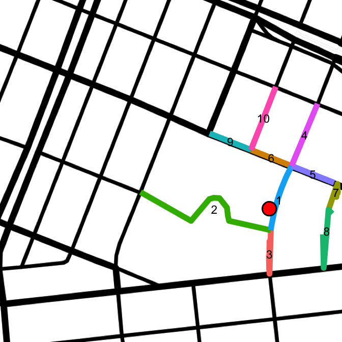

# Accuracy
Joe Willage  
March 30, 2016  


This is an exploration to achieve higher accuracy in mapping latitude and longitude to a street segment. Here a segment is defined as a section of street bounded by two other streets. The end goal is an abstracted pattern, but the motivation is to more accurately map trees in New York City to a specific block. 

The previous analysis left off by stating that an answer was reached, "but how valid is it?" Some inconsistancies were noted, specifically with the block that had the highest reported TPM. Recall the graphic that went with this statement. 


```r
library(ggmap)
library(knitr)
library(rjson)
library(dplyr)
library(tidyr)
```


```r
map.sewardPark <- get_map(location = "40.71597,-73.9889687", zoom = 17, maptype = "toner-lines")
ggmap(map.sewardPark) + 
   geom_point(data = treeMap[treeMap$blockId == 35,],
              aes(x = lon, y = lat, size = stumpDiam), alpha = 0.35, color = "chartreuse") +
   scale_size(range = c(5, 7)) +
   theme_nothing()
```

 

And note that all of these trees mapped to the block of Grand b/w Clinton and Suffolk, when most actually lie on Clinton St. The southmost tree mapped to this block is the following.


```r
block.35 <- treeMap[treeMap$blockId == 35, ]
head(block.35[order(block.35$lat), ], 1)
```

```
##          lat       lon stumpDiam number   street   zip     id blockId
## 1690 40.7153 -73.98717        12    410 Grand St 10002 165907      35
```

Tree 165907 is reverse geocoded as 410 Grand, but viewing the full tree data from the Tree Map website returns the nearest address as 187 Clinton, much more accurate. This may prove to be a useful alternative.  

However, the Geonames Find Nearby Streets (FNS) API provids another useful match. It's not the exact address that's needed for any tree, it's just the nearest street. In fact, that API provides not only the nearest street, but also the to/from addresses of the segment. A takeaway from the first analysis is that mixing and matching geocoding services gets messy. In attempt to minimize error, only the Geonames family of APIs will be used.  

For the tree of interest, here is the result from the Geonames Find Nearby Streets call.


```r
user <- readLines("../../geonames.txt")
fns.url <- paste0("http://api.geonames.org/findNearbyStreetsJSON?&username=", user, "&")
fns.parms <- paste0("lat=", block.35[order(block.35$lat), ][1, "lat"], 
                               "&lng=", block.35[order(block.35$lat), ][1, "lon"])
seg <- fromJSON(file = paste0(fns.url, fns.parms))
seg <- sapply(seg$streetSegment, function(i) c(i$name, i$fraddl, i$fraddr, i$toaddl, i$toaddr, 
                                              i$mtfcc, i$zip, i$postalcode, i$distance, i$line))
segments <- seg %>% t %>% as.data.frame(stringsAsFactors = FALSE) %>% 
            setNames(c("street",	"fraddl", "fraddr",	"toaddl", "toaddr",	 "mtfcc",	"zip", 
                       "distance", "line"))
segments[, 1:8]
```

```
##        street fraddl fraddr toaddl toaddr mtfcc   zip distance
## 1  Clinton St    166    167    184    185 S1400 10002     0.01
## 2                                         S1710          0.035
## 3  Clinton St    186    187    198    197 S1400 10002    0.036
## 4  Clinton St    140    139    164    165 S1400 10002    0.082
## 5    Grand St    408    411    424    425 S1400 10002    0.082
## 6    Grand St    390    389    406    409 S1400 10002    0.082
## 7                                         S1710            0.1
## 8                                         S1780            0.1
## 9    Grand St    374    383    388    387 S1400 10002    0.104
## 10 Suffolk St      1      2     61     62 S1400 10002    0.104
```

This useful result set returns the to and from addresses for both sides of the street, as well as the distance from the street (which is how the results are ordered). This may be useful in validation. A final component, not included in the above table, is the coordinate line of each segment. This allows for drawing a multi-segment line on a map, another useful tool in validation. Plotting these street segments results in the following


```r
segments[1, "line"]
```

```
## [1] "-73.986721 40.715952,-73.986835 40.715777,-73.986929 40.715603,-73.986996 40.715456,-73.987074 40.715241,-73.987129 40.715031,-73.987138 40.714974"
```

```r
segments$id <- seq_along(segments$street)
lines.list <- strsplit(segments$line, ",")
lines <- data.frame()
for (segment in 1:length(lines.list)){
  lines <- rbind(lines, cbind(segment, lines.list[[segment]]))
}
lines$V2 <- as.character(lines$V2)
lines <- separate(lines, V2, c("lon", "lat"), " ")
lines$lon <- as.numeric(lines$lon)
lines$lat <- as.numeric(lines$lat)
```


```r
# relevel to separate similar color lines
lines$segment <- factor(lines$segment, levels(lines$segment)[c(3, 6, 7, 2, 8, 9, 1, 5, 4, 10)])
means <- lines %>% group_by(segment) %>% summarize(lat = mean(lat), lon = mean(lon))
ggmap(map.sewardPark) + 
   geom_line(data = lines, aes(x = lon, y = lat, color = segment), size = 4) +
   theme_nothing() +
   geom_point(data = block.35[order(block.35$lat), ][1, ], aes(x = lon, y = lat), 
              size = 10) +
   geom_point(data = block.35[order(block.35$lat), ][1, ], aes(x = lon, y = lat), 
              size = 8, color = "red") +
   geom_text(data = means, aes(x = lon, y = lat, label = segment), size = 6)
```

 

The point of interest is indicated by the red dot, and each returned segment is uniquely colored. The first segment returned is definitely the most correct: Clinton from 166 - 185. Segment 2 is not wanted, and is actually just a sidewalk from Clinton to Essex. Segment 3 is the other segment that completes this block. Segments 4 - 10 are not part of the block. **The task at hand is to create a reproducible process that groups segments 1 and 3 into a block, and eliminates the other results**.  

The approach involves the Geonames Find Nearest Intersection (FNI) API. Each segment previously returned from FNS will have it's two endpoints passed into FNI. The order of rules is as follows:  

1) Segments are evaluated in the order of minimal `distance` from the point. The first segment will act as the reference point. Segments may be considered to be part of the block if their `street` is the same value as that of the first segment.   
1) A call is made to the FNI API using the segment's first and last coordinates.  
2) Endpoints that are within X `distance` of their nearest intersection are marked as a block end. X is close to 0.
2) If block has two ends, exit the process.  
3) If block has less than two ends, repeat for remaining segments.   

An example with the previous data is as follows:  
Segment 1 is the reference point and an FNI call is made with each of it's endpoints. The results are distinct. The distance of first endpoint is 0. The distance of the second endpoint is 0.7. Endpoint 1 is added as a block end. The block is still incomplete, process next segment. 

The street of segment 2 does not match the reference (segment 1). It's street name is actually the empty string. Skip this segment.  

Segment 3 has a matching street name, "Clinton St". The FNI calls are made for both endpoints. Distinct endpoints are returned. Endpoint 1 has distance 0.7, and endpoint 2 has distance 0. Endpoint 2 is added as a block end. The block now has two ends and is considered complete. The process exits.  

The entire process looks as follows:  


```r
blocks <- data.frame()
tmpBlock <- data.frame()
fni.url <- paste0("http://api.geonames.org/findNearestIntersectionJSON?&username=", user, "&")
for (i in 1 : nrow(segments)) {
  if (segments[i, "street"] != segments[1, "street"]) {
    next
  }
  fni.parms1 <- paste0("lat=", lines[lines$segment == i, "lat"][1], 
                       "&lng=", lines[lines$segment == i, "lon"][1])
  int1 <- fromJSON(file = paste0(fni.url, fni.parms1))
  fni.parms2 <- paste0("lat=", tail(lines[lines$segment == i, "lat"], 1), 
                       "&lng=", tail(lines[lines$segment == i, "lon"], 1))
  int2 <- fromJSON(file = paste0(fni.url, fni.parms2))

  if (int1$intersection$distance < 0.001) {
    tmpBlock <- rbind(tmpBlock, 
                      data.frame(i, street1 = int1$intersection$street1, 
                                 street2 = int1$intersection$street2,
                                 lat = int1$intersection$lat, lon = int1$intersection$lng, 
                                 stringsAsFactors = FALSE))
  } 
  if (int2$intersection$distance < 0.001) {
    tmpBlock <- rbind(tmpBlock, 
                      data.frame(i, street1 = int2$intersection$street1, 
                                 street2 = int2$intersection$street2,
                                 lat = int2$intersection$lat, lon = int2$intersection$lng, 
                                 stringsAsFactors = FALSE))
  } 
  if (nrow(tmpBlock) >= 2) {
    # TODO cast to a single row
    blocks <- rbind(blocks, tmpBlock)
    break
  }
}

blocks
```

```
##   i    street1    street2       lat        lon
## 1 1 Clinton St   Grand St 40.715952 -73.986721
## 2 3 E Broadway Clinton St 40.714312 -73.987165
```

