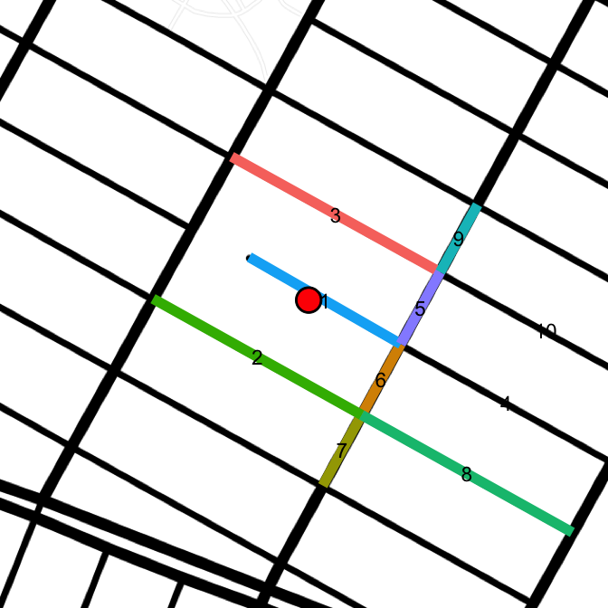
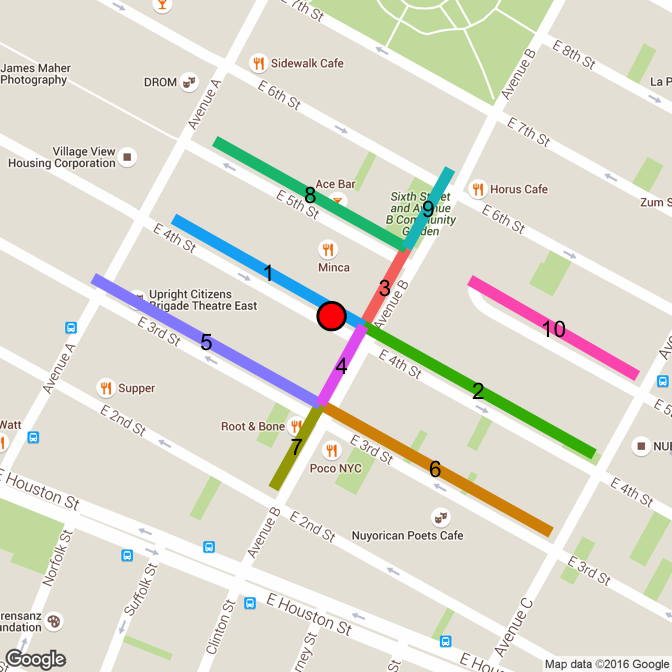

# Accuracy
Joe Willage  
March 30, 2016  


This is an exploration to achieve higher accuracy in mapping latitude and longitude to a street segment. Here a segment is defined as a section of street bounded by two other streets. The end goal is an abstracted pattern, but the motivation is to more accurately map trees in New York City to a specific block. 

The [previous analysis](http://www.joewillage.com/blog/2016/3/31/analyzing-new-yorks-trees) left off by stating that an answer to which block is the most tree lined had been reached, "but how valid is it?" Some inconsistencies were noted, specifically with the block that had the highest reported TPM. Recall the graphic that went with this statement. 


```r
library(ggmap)
library(knitr)
library(rjson)
library(dplyr)
library(tidyr)
```


```r
map.sewardPark <- get_map(location = "40.71597,-73.9889687", zoom = 17, maptype = "toner-lines")
ggmap(map.sewardPark) + 
   geom_point(data = treeMap[treeMap$blockId == 35,],
              aes(x = lon, y = lat, size = stumpDiam), alpha = 0.35, color = "chartreuse") +
   scale_size(range = c(5, 7)) +
   theme_nothing()
```

 


```r
block.35 <- treeMap[treeMap$blockId == 35, ]
```
And note that all of these points mapped to the block of Grand b/w Clinton and Suffolk, when most actually lie on Clinton St. The southmost point mapped to this block is tree 165907 (40.7153009, -73.9871687). Tree 165907 is reverse geocoded as 410 Grand, with the ArcGIS API. One alternative is retrieving the full tree data from the Tree Map website. That returns the nearest address as 187 Clinton. Much more accurate, but not extensible. 

It's not the exact address that's needed for a given point, just the block it lies on. The Geonames Find Nearby Streets (FNS) API proves useful here. In fact, that API provides not only the nearest street, but also the to/from addresses of the segment (JICOC [just in case, of course]). A takeaway from the first analysis is that mixing and matching geocoding services gets messy. In attempt to minimize error, only the Geonames family of APIs will be used.  

For the point of interest, here is the result from the Geonames Find Nearby Streets call.


```r
user <- readLines("../../geonames.txt")
fns.url <- paste0("http://api.geonames.org/findNearbyStreetsJSON?&username=", user, "&")
fns.parms <- paste0("lat=", block.35[order(block.35$lat), ][1, "lat"], 
                               "&lng=", block.35[order(block.35$lat), ][1, "lon"])
seg <- fromJSON(file = paste0(fns.url, fns.parms))
seg <- sapply(seg$streetSegment, function(i) c(i$name, i$fraddl, i$fraddr, i$toaddl, i$toaddr, 
                                              i$mtfcc, i$zip, i$postalcode, i$distance, i$line))
segments <- seg %>% t %>% as.data.frame(stringsAsFactors = FALSE) %>% 
            setNames(c("street",	"fraddl", "fraddr",	"toaddl", "toaddr",	 "mtfcc",	"zip", 
                       "distance", "line"))
segments[, 1:8]
```

```
##        street fraddl fraddr toaddl toaddr mtfcc   zip distance
## 1  Clinton St    166    167    184    185 S1400 10002     0.01
## 2                                         S1710          0.035
## 3  Clinton St    186    187    198    197 S1400 10002    0.036
## 4  Clinton St    140    139    164    165 S1400 10002    0.082
## 5    Grand St    408    411    424    425 S1400 10002    0.082
## 6    Grand St    390    389    406    409 S1400 10002    0.082
## 7                                         S1710            0.1
## 8                                         S1780            0.1
## 9  Suffolk St      1      2     61     62 S1400 10002    0.104
## 10   Grand St    374    383    388    387 S1400 10002    0.104
```

This useful result set returns the to and from addresses for both sides of the street, as well as the distance from the street (in fact that's how the results are ordered). This may be useful in validation down the line. A final component, not included in the above table, are the coordinate that make up each segment. This is a robust value, and includes not just the points for the start and end of the segment, but points of curvature in between. This allows for drawing a multi-point segment on a map, another useful tool in validation. Plotting these segments results in the following


```r
drawLines <- function(lat, lon, maptype){
  fns.parms <- paste0("lat=", lat, "&lng=", lon)
  seg <- fromJSON(file = paste0(fns.url, fns.parms))
  seg <- sapply(seg$streetSegment, function(i) c(i$name, i$fraddl, i$fraddr, i$toaddl, i$toaddr, 
                                                i$mtfcc, i$zip, i$postalcode, i$distance, i$line))
  segments <- seg %>% t %>% as.data.frame(stringsAsFactors = FALSE) %>% 
              setNames(c("street",	"fraddl", "fraddr",	"toaddl", "toaddr",	 "mtfcc",	"zip", 
                         "distance", "line"))
  segments$id <- seq_along(segments$street)
  lines.list <- strsplit(segments$line, ",")
  lines <- data.frame()
  for (segment in 1:length(lines.list)){
    lines <- rbind(lines, cbind(segment, lines.list[[segment]]))
  }
  lines$V2 <- as.character(lines$V2)
  lines <- lines %>% separate(V2, c("lon", "lat"), " ") %>% 
            mutate(lon = as.numeric(lon), lat = as.numeric(lat))
  # relevel to separate similar color lines
  lines$segment <- factor(lines$segment, levels(lines$segment)[c(3, 6, 7, 2, 8, 9, 1, 5, 4, 10)])
  means <- lines %>% group_by(segment) %>% summarize(lat = mean(lat), lon = mean(lon))
  map <- get_map(location = paste0(lat, ",", lon), zoom = 17, maptype = maptype)
  ggmap(map) + 
     geom_line(data = lines, aes(x = lon, y = lat, color = segment), size = 4) +
     theme_nothing() +
     geom_point(data = data.frame(lon = lon, lat = lat), aes(x = lon, y = lat), 
                size = 10) +
     geom_point(data = data.frame(lon = lon, lat = lat), aes(x = lon, y = lat), 
                size = 8, color = "red") +
     geom_text(data = means, aes(x = lon, y = lat, label = segment), size = 6)
}

drawLines(block.35[order(block.35$lat), ][1, "lat"], block.35[order(block.35$lat), ][1, "lon"],
          "toner-lines")
```

 

The point of interest is indicated by the red dot, and each returned segment is uniquely colored. The first segment returned is definitely the most correct: Clinton from 166 - 185. Segment 2 is unwanted, and is actually just a sidewalk from Clinton to Essex. Segment 3 is the other segment that completes this block. Segments 4 - 10 are not part of the block. **The task at hand is to create a reproducible process that groups segments 1 and 3 into a block, and eliminates the other results**.  

The approach involves the Geonames Find Nearest Intersection (FNI) API. Each segment previously returned from the FNS API will have it's two endpoints passed into FNI. The order of rules is as follows:  

1) Segments are evaluated in the order of minimal `distance` from the point. The first segment will act as the reference point. Segments may be considered to be part of the block only if their `street` is the same value as that of the first segment.   
1) A call is made to the FNI API using the segment's endpoints (first and last coordinates).  
2) Endpoints that are within X `distance` of their nearest intersection are marked as a block end. X is close to 0.
2) If the block has two ends, exit the process.  
3) If the block has less than two ends, repeat with the remaining segments.   

An example with the previous data is as follows:  
Segment 1 is the reference point and an FNI call is made with each of it's endpoints. Two distinct intersections are returnd. The distance of the first endpoint to it's nearest intersction is 0. The distance of the second endpoint to it's nearest intersection is 0.7. Endpoint 1 is added as a block end. The block is still incomplete, process next segment. 

The street of segment 2 does not match the reference (segment 1). It's street name is actually an empty string. Skip this segment.  

Segment 3 has a matching street name, "Clinton St". The FNI calls are made for both endpoints. Distinct endpoints are returned. Endpoint 1 has distance 0.7, and endpoint 2 has distance 0. Endpoint 2 is added as a block end. The block now has two ends and is considered complete. The process exits.  

The entire process looks as follows:  


```r
blocks <- data.frame()
tmpBlock <- data.frame()
fni.url <- paste0("http://api.geonames.org/findNearestIntersectionJSON?&username=", user, "&")
for (segment in 1 : nrow(segments)) {
  primary <- segments[1, "street"]
  if (segments[segment, "street"] != primary) {
    next
  }
  fni.parms1 <- paste0("lat=", lines[lines$segment == segment, "lat"][1], 
                       "&lng=", lines[lines$segment == segment, "lon"][1])
  int1 <- fromJSON(file = paste0(fni.url, fni.parms1))
  fni.parms2 <- paste0("lat=", tail(lines[lines$segment == segment, "lat"], 1), 
                       "&lng=", tail(lines[lines$segment == segment, "lon"], 1))
  int2 <- fromJSON(file = paste0(fni.url, fni.parms2))

  if (int1$intersection$distance < 0.001) {
    streets <- c(int1$intersection$street1, int1$intersection$street2)
    street <- streets[streets != primary]
    tmpBlock <- rbind(tmpBlock, 
                      data.frame(segment, street = street,
                                 lat = int1$intersection$lat, lon = int1$intersection$lng, 
                                 stringsAsFactors = FALSE))
  } 
  if (int2$intersection$distance < 0.001) {
    streets <- c(int2$intersection$street1, int2$intersection$street2)
    street <- streets[streets != primary]
    tmpBlock <- rbind(tmpBlock, 
                      data.frame(segment, street = street,
                                 lat = int2$intersection$lat, lon = int2$intersection$lng, 
                                 stringsAsFactors = FALSE))
  } 
  if (nrow(tmpBlock) >= 2) {
    blocks <- rbind(blocks, cbind(nrow(blocks) + 1, primary, tmpBlock[1, ], tmpBlock[2, ]))
    break
  }
}

names(blocks) <- c("id", "primary.street", "cross1.segment", "cross1.street", "cross1.lat",
                   "cross1.lon", "cross2.segment", "cross2.street", "cross2.lat", "cross2.lon")
blocks
```

```
##   id primary.street cross1.segment cross1.street cross1.lat cross1.lon
## 1  1     Clinton St              1      Grand St  40.715952 -73.986721
##   cross2.segment cross2.street cross2.lat cross2.lon
## 1              3    E Broadway   40.71431 -73.987165
```

The method works well for a single point. The next challenge is iterating through a list of points, checking if they belong to an existing block or if a new block needs to be created. With this process, the FNS API is called for each point and a matching block is created. This ensures **accuracy**. A less expensive approach may be to create for each block a polygon (ie thin rectangle for a straight-line block) and check if the point lies within. 


```r
getSegments <- function(lat, lon) {
  fns.parms <- paste0("lat=", lat, "&lng=", lon)
  seg <- fromJSON(file = paste0(fns.url, fns.parms))
  seg <- sapply(seg$streetSegment, function(i) c(i$name, i$fraddl, i$fraddr, i$toaddl, i$toaddr, 
                                                i$mtfcc, i$zip, i$postalcode, i$distance, i$line))
  segments <- seg %>% t %>% as.data.frame(stringsAsFactors = FALSE) %>% 
              setNames(c("street",	"fraddl", "fraddr",	"toaddl", "toaddr",	 "mtfcc",	"zip", 
                         "distance", "line"))
  # grab first and last coordinate for each segment
  segments[, c("coord1", "coord2")] <- t(sapply(strsplit(segments$line, ","), 
                                                function(z) c(z[1], z[length(z)])))
  segments <- segments %>% separate(coord1, c("lon1", "lat1"), " ") %>% 
              separate(coord2, c("lon2", "lat2"), " ") 
  segments$id <- seq_along(segments$street)
  segments[, c(1:8, 10:14)]
} 
```

A `getSegments` function is broken out to find all the nearest segments to a given point. The code to grab the beginning and ending coordinates for a segment is streamlined in an sapply statement. The complete lines are disgarded, as can be seen by the absence of column 9 in the final statement.  

Another small function, `getStreet` helps with code reuse.


```r
getStreet <- function(primary, intersection) {
  streets <- c(intersection$street1, intersection$street2)
  street <- streets[streets != primary]
  if (length(street) > 1) {
   street <- paste(street, collapse = " & ")
  }  
  street
}
```

Now, embedding this process within a loop for every point will look like this:


```r
# seed blocks table with correct data types
blocks <- data.frame(id = 1, primary.street = "Clinton St", cross1.segment = 1, 
                     cross1.street = "E Broadway", cross1.lat = "40.715952", 
                     cross1.lon = "-73.986721", cross2.segment = 1, cross2.street = "Grand St",
                     cross2.lat = "40.715952", cross2.lon = "-73.986721", count = 0, 
                     stringsAsFactors = FALSE)
err <- NULL
tmpBlock <- NULL
treeMap$blockId <- NULL
for (tree in 1:nrow(treeMap)) { 
  segments <- getSegments(treeMap[tree, "lat"], treeMap[tree, "lon"])
  primary <- segments[1, "street"]
  tmpBlock <- data.frame()
  for (segment in 1 : nrow(segments)) {
    if (segments[segment, "street"] != primary) {
      next
    }
    fni.parms1 <- paste0("lat=", segments[segment, "lat1"], 
                         "&lng=", segments[segment, "lon1"])
    int1 <- fromJSON(file = paste0(fni.url, fni.parms1))
    fni.parms2 <- paste0("lat=", segments[segment, "lat2"], 
                         "&lng=", segments[segment, "lon2"])
    int2 <- fromJSON(file = paste0(fni.url, fni.parms2))

    if (int1$intersection$distance < 0.001) {
      tmpBlock <- rbind(tmpBlock, 
                        data.frame(segment, street = getStreet(primary, int1$intersection),
                                   lat = int1$intersection$lat, lon = int1$intersection$lng, 
                                   stringsAsFactors = FALSE))
    } 
    if (int2$intersection$distance < 0.001) {
      tmpBlock <- rbind(tmpBlock, 
                        data.frame(segment, street = getStreet(primary, int2$intersection),
                                   lat = int2$intersection$lat, lon = int2$intersection$lng, 
                                   stringsAsFactors = FALSE))
    } 
     if (nrow(tmpBlock) == 2) {
       minStreet <- which(tmpBlock$street == min(tmpBlock$street))
       tmpBlock <- cbind(tmpBlock[minStreet, ], tmpBlock[-minStreet, ])
       names(tmpBlock) <- c("cross1.segment", "cross1.street", "cross1.lat", "cross1.lon",
                            "cross2.segment", "cross2.street", "cross2.lat", "cross2.lon")
       break
     } else if (nrow(tmpBlock) > 2) {
       # error caught in the below null check. Usually signifies a block missing some segment
       tmpBlock <- NULL
       break
     }
  }
  if (is.null(tmpBlock$cross1.segment) | is.null(tmpBlock$cross2.segment)) {
    # 2 endpoints were not found in the list of segments. add to error list and go to next poitn
    err <<- c(err, tree)
    tmpBlock <- NULL
    next
  }
  x <- inner_join(tmpBlock, blocks, 
                  by = c("cross1.lat" = "cross1.lat", "cross1.lon" = "cross1.lon",
                         "cross2.lat" = "cross2.lat", "cross2.lon" = "cross2.lon"))
  if (nrow(x) > 0) {
    # block exists
    blocks[blocks$id == x$id, "count"] <- blocks[blocks$id == x$id, "count"] + 1
    treeMap[tree, "blockId"] <- blocks[blocks$id == x$id, "id"]
  } else{
    blocks <- rbind(blocks, 
                    cbind(id = nrow(blocks) + 1, primary.street = primary, tmpBlock, count = 1))
    treeMap[tree, "blockId"] <- nrow(blocks)
  }
}
```


Most of the points are successfully mapped to blocks, but errors out on point 985 (more on that later).


```r
length(err)
```

```
## [1] 36
```

```r
errTable <- table(treeMap[err, "street"])
errTable 
```

```
## 
##     Allen St  Attorney St     Avenue D    Broome St     Canal St 
##            3            4            3            2            1 
##   Clinton St  Delancey St     E 4th St   E 4th Walk     E 5th St 
##            1            3            3            2           11 
## E Houston St     Essex St     Grand St 
##            1            1            1
```

Out of the 36 errors recorded, the majority are on E 5th St. Looking at the data, those points lie on a dead-end street which indeed has only a single intersection. How can that be recorded in the data? 


```r
drawLines(treeMap[67, "lat"], treeMap[67, "lon"], "toner-lines")
```

 


Here is another point that was caught as an error


```r
drawLines(treeMap[462, "lat"], treeMap[462, "lon"])
```

 

The FNS API doesn't return segments to complete the full block between Ave A and B. Even with the radius set to the max of 1 km, no additional segments are returned. In both of these cases, the `tmpBlock` dataframe captures the correct single end from the primary block. But it also captures both ends of the segment next to it (segment 2 in the above image). This has motivated a fall back option when `tmpBlock` includes more than 2 block ends. In these cases, the endpoints of the primary segment will be used for both block ends, even though one end does not sit on an intersection. Essentially, the segment is stretched out to the nearest intersection. 

For the above point, 462, this means the block is mapped to 4th St b/w A and B. For the 5th St dead-end segment (67), it will be recorded as 5th St b/w B and C. Unfortunately, it's impossible to distinguish between an actual dead-end block and one that simply didn't return it's complete segments. The above two cases look the same from the data point of view. It's only with the actual map underlaid that it can be seen 4th does indeed intersect with Avenue A and 5th doesn't interset with Avenue B.  

In the code, an additional chunk is added to preserve the intersections from the primary segment. If the loop later finds more than 2 block ends, it will default to using the intersections nearest the primary block.   

Another addition is a check if `minStreet > 1`. This handles situations where both block ends are the same intersection, marking the second one as NA. This was the case for the point that broke the loop, 985.  

**`<Interesting digression alert>`**  
Here is the block which threw the error


```r
drawLines(treeMap[985, "lat"], treeMap[985, "lon"], "terrain")
```

 

The point is on the north side of Grand St. One of the design choices is to combine both sides of the street. So whether on the north or south, blocks on Grand will be split at Pitt, Bialystoker, East Broadway (1), East Broadway (2), Columbia, Henriy/Jackson, Lewis, and Madison. The point lies on the intersection between E Broadway and E Broadway. There is a weird triangle where East Broadway splits into a small west-bound section and then a separate east-bound section. The block should legitimately be on Grand between E Broadway and E Broadway (segment 1 between segments 5 and 2). This is a rare instance where the same intersection should correctly be used for both block ends. `< / Digression>`     

The added chunks are as follows  


```r
    if (segment == 1) {
      primary.int1 <- int1
      primary.int2 <- int2
    }

###############################

   if (nrow(tmpBlock) > 2) {
       tmpBlock <- rbind(data.frame(1, street = getStreet(primary, primary.int1$intersection),
                                  ...),
                         data.frame(1, street = getStreet(primary, primary.int2$intersection),
                                   ...))       
   }

###############################

 minStreet <- which(tmpBlock$street == min(tmpBlock$street))
       if (length(minStreet) > 1) {
         tmpBlock <- cbind(tmpBlock[1, ], "NA", "NA", "NA", "NA")
       }
```


That method accounts for many of the previous errors. The following blocks were captured.  


```r
prevErrs <- blocks[grepl("&", blocks$cross1.street) | grepl("&", blocks$cross2.street) | grepl("NA", blocks$cross2.street), c(1, 2, 4, 8, 11)]
prevErrs
```

```
##       id  primary.street                  cross1.street
## 23     6         Pitt St                      Broome St
## 48    48    E Houston St                    Columbia St
## 87    87     Attorney St                     Stanton St
## 237   90    E Houston St                Ave C & Pitt St
## 241  101        Essex St           Ave A & E Houston St
## 109  109       Broome St    Bialystoker Pl & Abraham Pl
## 254  133    E Houston St                Ave C & Pitt St
## 154  154        E 6th St                          Ave D
## 273  177      Clinton St Delancey St & Williamsburg Brg
## 189  189   Staten St Exn           Stanton St & Pitt St
## 295  224           Ave C                       E 2nd St
## 299  228       Peretz Sq       Ludlow St & E Houston St
## 2103 235      Abraham Pl     Bialystoker Pl & Broome St
## 2441 244   Delancey St S      Delancey St & Attorney St
## 2451 245        Grand St                     E Broadway
## 2601 260      Stanton St             Bowery & Prince St
## 2631 263       Hester St                      Ludlow St
## 2641 264      E Broadway                       Grand St
## 2721 272   Delancey St S                     Clinton St
## 2791 279    E Houston St            Ave D & Columbia St
## 2871 287     Columbia St                   Rivington St
## 2901 290      Clinton St                   Rivington St
## 305  305 Lillian Wald Dr                   E Houston St
## 315  315      Norfolk St                    Delancey St
## 320  320     Delancey St            Bowery & Kenmare St
## 2137 325        Essex St                       Grand St
## 2141 333         1st Ave                       E 1st St
## 2142 334    E Houston St            Columbia St & Ave D
##                         cross2.street count
## 23    Samuel Dickstein Plz & Grand St    17
## 48        Lillian Wald Dr & Baruch Dr     2
## 87                                 NA     5
## 237                          Ridge St     4
## 241                        Stanton St     9
## 109                           Pitt St     1
## 254                        Sheriff St     9
## 154                                NA     2
## 273                      Rivington St     2
## 189                    Stanton St Exn     3
## 295            E Houston St & Pitt St     1
## 299                        Orchard St     6
## 2103                         Grand St     7
## 2441                         Ridge St     2
## 2451                               NA     3
## 2601                      Chrystie St     3
## 2631                               NA     7
## 2641                               NA     2
## 2721                               NA     2
## 2791                  Lillian Wald Dr     3
## 2871                               NA     1
## 2901 Williamsburg Brg & Delancey St N     1
## 305                                NA     1
## 315                                NA     1
## 320                       Chrystie St     3
## 2137            Hester St & Ludlow St     1
## 2141          E Houston St & Allen St     1
## 2142                       Sheriff St     1
```

These 28 blocks account for 100 points. Fortunately, correcting this is a relatively simple process: look up the coordinates (not shown) in a [map website](http://www.geonames.org/maps/us-reverse-geocoder.html) and plug the correct cross street directly into the `blocks` dataframe. For a larger number of blocks, this may be a job for Mechanical Turks[^1].  

The remaining problem-points fell into the catch-all group (`err`), which includes only 17 points. The first one looks like this. 


```r
drawLines(treeMap[err[1], "lat"], treeMap[err[1], "lon"], "toner-lines") 
```

 

Here, even the map layer fails to capture the actual streets. The first 4 error points lie on Lillian Wald Dr, a block that actually loops around PS 188. Those streets are made up of segments 1 (roughly), 8 + 4, and a segment between 4 and the middle of 5. An accurate row for these points would have primary street as Lillian Wald Dr, and both cross streets as E Houston St.  

Here is a map of all the un-handled error points.  


```r
lat.mid <- mean(c(min(treeMap[err, "lat"]), max(treeMap[err, "lat"])))
lon.mid <- mean(c(min(treeMap[err, "lon"]), max(treeMap[err, "lon"])))
map.errs <- get_map(location = paste0(lat.mid, ",", lon.mid), zoom = 15, maptype = "toner-lines")
ggmap(map.errs) + 
   geom_point(data = treeMap[err, ],
              aes(x = lon, y = lat), alpha = 0.4, color = "blue", size = 8) +
   theme_nothing()
```

 

Rather than manually correctly all of these, clustering will be group points close together, and the clusters can be manually corrected. That will knock the work down from 17 to 7 clusters.  


```r
treeMap.err <- treeMap[err, ]
set.seed(123)
km <- kmeans(cbind(treeMap.err[, "lat"], treeMap.err[, "lon"]), centers = 7, nstart = 50)
treeMap.err$cluster <- as.factor(km$cluster)
ggmap(map.errs) + 
   geom_point(data = treeMap.err,
              aes(x = lon, y = lat, color = cluster), alpha = 0.4, size = 8) +
   theme_nothing() 
```

 

Basic K-means clustering with k = 7 appears to have done the trick. Remember the dark-green cluster is the block of Lillian Wald Dr which loops off Houston. Now 7 blocks will be manually inserted into the blocks table, based on the clustered coordinates.  


```r
km$centers
```

```
##       [,1]      [,2]
## 1 40.71730 -73.98577
## 2 40.72277 -73.99273
## 3 40.71987 -73.97699
## 4 40.71556 -73.98579
## 5 40.71491 -73.99019
## 6 40.71501 -73.98725
## 7 40.71524 -73.99475
```


[^1]:  **AWS Mechanical Turk**  
  AWS service that allows users to pay for humans to perform a rote task.  
  https://aws.amazon.com/documentation/mturk/ &nbsp;&nbsp;&nbsp;
