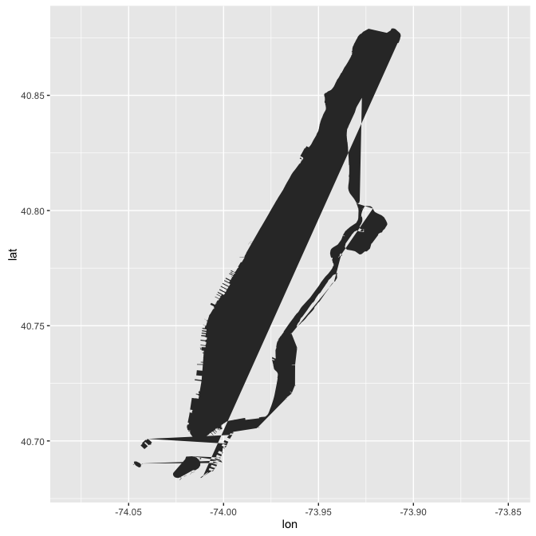
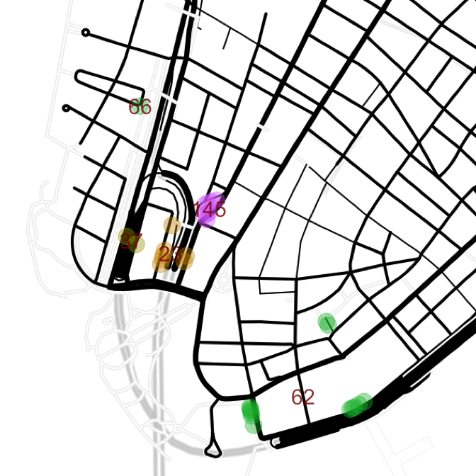
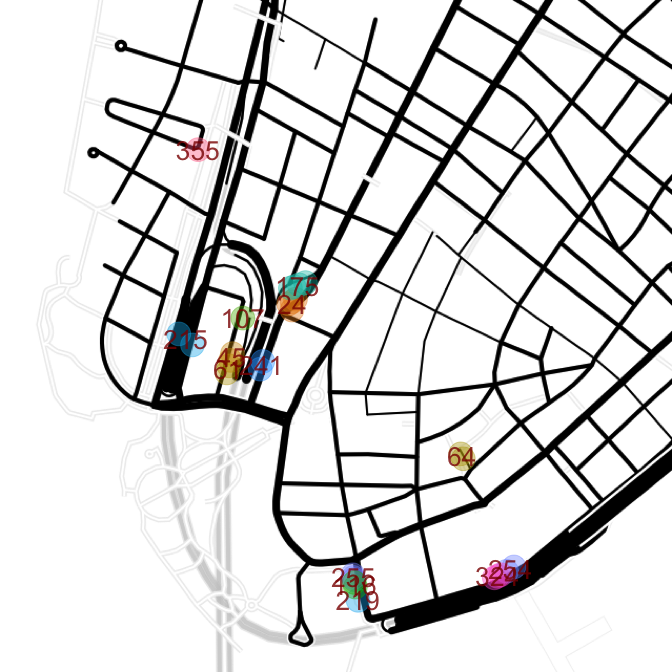
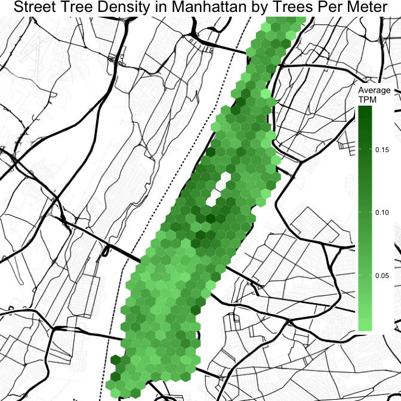

# Revised
Joe Willage  
April 14, 2016  


This is the third and final installment in a series discussing trees and geocoordinate accuracy in New York City. The [first article](http://www.joewillage.com/blog/2016/3/31/analyzing-new-yorks-trees) established a baseline and connected to the NYC Tree Map data source. The [second article](http://www.joewillage.com/blog/2016/4/10/achieving-accuracy-in-mapping-coordinates-to-street-blocks) focused on achieving a higher accuracy in mapping points to street blocks. This article brings the other two together, applying generic coordinate mapping to the full list of Manhattan street trees, in order to determine which block in the city has the most trees. The metric includes trees from both sides of the block as well as any trees in the median.     

The first step is calling the Tree Map API[^1]. This data set contains all the *street trees* in New York. The API returns a rectangular polygon filled with points representing trees. Unfortunately, the island of Manhattan doesn't fit easily onto a rectangle. So an MBB covering Manhattan is defined, and all trees outside of that area are pruned.  


```r
library(ggmap)
library(knitr)
library(rjson)
library(dplyr)
library(tidyr)
library(sp)
library(data.table)
library(hexbin)
```


```r
border.corner.sw.lat <- "40.7006164"
border.corner.sw.long <- "-74.020083"
border.corner.ne.lat <- "40.8778038"
border.corner.ne.long <- "-73.9085997"

treemap.url <- paste("https://tree-map.nycgovparks.org/points",
              border.corner.sw.lat, border.corner.sw.long, 
              border.corner.ne.lat, border.corner.ne.long,
              "undefined", sep = "/")
treeMap <- data.frame()
# Retrieve 1000 trees at a time
for (i in 1:87) { # ~64K trees in Manh + various trees from BK, Qns, Bx that are in the box = 87K
  raw <- fromJSON(file = paste(treemap.url, i, 1000, sep = "/"))
  tmp <- lapply(raw$item, function(x) {
    c(x$id, x$lat, x$lng, x$stumpdiameter, x$species$id)
  })
  tmpdf <- data.frame(matrix(unlist(tmp), ncol = 5, byrow = TRUE), stringsAsFactors = FALSE)
  treeMap <- rbind(treeMap, tmpdf)
}
names(treeMap)[1:5] <- c("id", "lat", "lon", "stumpDiam", "speciesId")
```


```r
head(treeMap)
```

```
##       id      lat       lon stumpDiam speciesId
## 1 165318 40.78089 -73.91049        18        56
## 2 268508 40.81959 -73.91037         6        56
## 3 286704 40.81951 -73.91040         6        56
## 4 601641 40.81381 -73.90879         5        56
## 5  69546 40.83298 -73.91731         5        89
## 6  71263 40.83952 -73.92308         3        89
```

Next, the dataframe is subset to just trees in Manhattan. The first step here is to retrieve a shape file describing Manhattan[^2].     


```r
shapes <- fromJSON(file = paste0("http://services5.arcgis.com/GfwWNkhOj9bNBqoJ/arcgis/rest/",
                                 "services/nybb/FeatureServer/0/query?where=1=1&outFields=*&",
                                 "outSR=4326&f=geojson"))
boroughs <- sapply(shapes$features, function(x) x$properties$BoroName)
manh <- which(boroughs == "Manhattan")
coords.manh <- shapes$features[[manh]]$geometry$coordinates
df.manh <- data.frame(matrix(unlist(coords.manh), ncol = 2, byrow = TRUE), stringsAsFactors = FALSE)
names(df.manh) <- c("lon", "lat")
ggplot(data = df.manh, aes(x = lon, y = lat)) +
  geom_polygon() +
  scale_x_continuous(limits = c(-74.08, -73.85))
```



This works pretty well, except for the giant line down the middle of the city causing half of Manhattan to not exist.  

To solve this, each point in the polygon is assigned a number, and from that it can be determined which points should stay and which should go. 


```r
df.manh$num <- seq_along(df.manh$lon)
g <- ggplot(data = df.manh, aes(x = lon, y = lat, num = num)) +
      geom_polygon() + 
      geom_point(aes(color = num)) +
      scale_color_continuous(low = "blue", high = "red") 
g
```


The area of interest is the main island of Manhattan. It looks like that's the polygon described by the bright red through purple points, starting and ending at Inwood. Using the legend, that appears to be about points 1100 and up (fine-tuned to this number with trial and error). All the points below 1100 are removed. The weird island floating up by the Bronx should be removed as well (points > 6130). 


```r
df.manh.subset <- subset(df.manh, num > 1100 & num < 6130)
g <- ggplot(data = df.manh.subset, aes(x = lon, y = lat, num = num)) +
      geom_polygon() + 
      geom_point(aes(color = num)) +
      scale_color_continuous(low = "blue", high = "red") 
g
```


Better.  


```r
points.manh <- point.in.polygon(treeMap$lon, treeMap$lat, 
                                df.manh.subset[, "lon"],  df.manh.subset[, "lat"])
treeMap <- treeMap[points.manh > 0, ]
```

Now that the correct points are collected, they need to be mapped to a street block. That requires simultaneously building a table of street blocks. The general concept is to loop through each Manhattan tree, using the following process. First, find out what street `segment` the tree's coordinates are on. Segments are two points that define a straight line, and blocks can be made up of multiple segments. So the next step is finding all the segments that make up the block. This is done by checking the distance between each segment end and its nearest intersection[^3]. If the distance is almost 0, the segment end is marked as the end of the block. Repeat until the other block end is found, or all segments are exhausted (and enter an error state). Next, a check is performed to see if the street block already exists in the blocks table, or if it needs to be added. Finally, the tree is assigned the resulting block number. Repeat for all trees. See the [last post](http://www.joewillage.com/blog/2016/4/10/achieving-accuracy-in-mapping-coordinates-to-street-blocks) for more detailed explanations of the process.  


```r
user <- readLines("../../geonames.txt")
fns.url <- paste0("http://api.geonames.org/findNearbyStreetsJSON?username=", user, "&")
fni.url <- paste0("http://api.geonames.org/findNearestIntersectionJSON?username=", user, "&")

getSegments <- function(lat, lon) {
  fns.parms <- paste0("lat=", lat, "&lng=", lon)
  seg <- fromJSON(file = paste0(fns.url, fns.parms))
  seg <- sapply(seg$streetSegment, function(i) c(i$name, i$fraddl, i$fraddr, i$toaddl, i$toaddr, 
                                                i$mtfcc, i$zip, i$postalcode, i$distance, i$line))
  segments <- seg %>% t %>% as.data.frame(stringsAsFactors = FALSE) %>% 
              setNames(c("street",	"fraddl", "fraddr",	"toaddl", "toaddr",	 "mtfcc",	"zip", 
                         "distance", "line"))
  segments[, c("coord1", "coord2")] <- t(sapply(strsplit(segments$line, ","), 
                                                function(z) c(z[1], z[length(z)])))
  segments <- segments %>% separate(coord1, c("lon1", "lat1"), " ") %>% 
              separate(coord2, c("lon2", "lat2"), " ") 
  segments$id <- seq_along(segments$street)
  segments[, c(1:8, 10:14)]
} 

getStreet <- function(primary, intersection) {
  streets <- c(intersection$street1, intersection$street2)
  street <- streets[streets != primary]
  if (length(street) > 1) {
   street <- paste(street, collapse = " & ")
  }  
  street
}

# seed blocks table with correct data types
blocks <- data.frame(id = 1, primary.street = "Clinton St", cross1.segment = 1, 
                     cross1.street = "E Broadway", cross1.lat = "40.7143361", 
                     cross1.lon = "-73.9872163", cross2.segment = 1, cross2.street = "Grand St",
                     cross2.lat = "40.715952", cross2.lon = "-73.986721", count = 0, 
                     stringsAsFactors = FALSE)
err <- NULL
tmpBlock <- NULL
treeMap$blockId <- NULL
for (tree in 1:nrow(treeMap)) { 
  tryCatch({
    segments <- getSegments(treeMap[tree, "lat"], treeMap[tree, "lon"])
    primary <- segments[1, "street"]
    tmpBlock <- data.frame()
    for (segment in 1 : nrow(segments)) {
      if (segments[segment, "street"] != primary) {
        next
      }
      fni.parms1 <- paste0("lat=", segments[segment, "lat1"], 
                           "&lng=", segments[segment, "lon1"])
      int1 <- fromJSON(file = paste0(fni.url, fni.parms1))
      fni.parms2 <- paste0("lat=", segments[segment, "lat2"], 
                           "&lng=", segments[segment, "lon2"])
      int2 <- fromJSON(file = paste0(fni.url, fni.parms2))
  
      if (segment == 1) {
        primary.int1 <- int1
        primary.int2 <- int2
      }
  
      if (int1$intersection$distance < 0.001) {
        tmpBlock <- rbind(tmpBlock, 
                          data.frame(segment, street = getStreet(primary, int1$intersection),
                                     lat = int1$intersection$lat, lon = int1$intersection$lng, 
                                     stringsAsFactors = FALSE))
      } 
      if (int2$intersection$distance < 0.001) {
        tmpBlock <- rbind(tmpBlock, 
                          data.frame(segment, street = getStreet(primary, int2$intersection),
                                     lat = int2$intersection$lat, lon = int2$intersection$lng, 
                                     stringsAsFactors = FALSE))
      } 
      if (nrow(tmpBlock) > 2) {
        # error state with incomplete segments. Use primary segment for full block
         tmpBlock <- rbind(data.frame(1, street = getStreet(primary, primary.int1$intersection),
                                      lat = int1$intersection$lat, lon = int1$intersection$lng, 
                                      stringsAsFactors = FALSE),
                           data.frame(1, street = getStreet(primary, primary.int2$intersection),
                                      lat = int2$intersection$lat, lon = int2$intersection$lng, 
                                      stringsAsFactors = FALSE))       
       }
       if (nrow(tmpBlock) == 2) {
         minStreet <- which(tmpBlock$street == min(tmpBlock$street))
         if (length(minStreet) > 1) {
           tmpBlock <- cbind(tmpBlock[1, ], "NA", "NA", "NA", "NA")
         } else{
           tmpBlock <- cbind(tmpBlock[minStreet, ], tmpBlock[-minStreet, ])
         }
         names(tmpBlock) <- c("cross1.segment", "cross1.street", "cross1.lat", "cross1.lon",
                              "cross2.segment", "cross2.street", "cross2.lat", "cross2.lon")
         break
       } 
    }
    if (is.null(tmpBlock$cross1.segment) | is.null(tmpBlock$cross2.segment)) {
      err <<- c(err, tree)
      tmpBlock <- NULL
      next
    }
    x <- inner_join(tmpBlock, blocks, 
                    by = c("cross1.lat" = "cross1.lat", "cross1.lon" = "cross1.lon",
                           "cross2.lat" = "cross2.lat", "cross2.lon" = "cross2.lon"))
    if (nrow(x) > 0) {
      # block exists
      blocks[blocks$id == x$id, "count"] <- blocks[blocks$id == x$id, "count"] + 1
      treeMap[tree, "blockId"] <- blocks[blocks$id == x$id, "id"]
    } else{
      blocks <- rbind(blocks, 
                      cbind(id = nrow(blocks) + 1, primary.street = primary, tmpBlock, count = 1))
      treeMap[tree, "blockId"] <- nrow(blocks)
    }},
  error = function(e){
    print(paste(timestamp(quiet = T)), e)
    Sys.sleep(60 * 60)  # sleep for API limit
    tree <- tree - 1
  })
}
```


```r
length(err) 
```

```
## [1] 925
```

There are a lot of errors left over, but not too bad relative to the total number of trees mapped (1.44%). The previous post introduced k-means clustering to group a block of trees together. The clustering method helps reduce the amount of manual labor, but the number of clusters has to be conservative, and clusters have to be verified. The starting number of clusters is obtained by dividing the number of errors by the median number of trees per block, resulting in 185 clusters. The hope is that each cluster will map to a block.


```r
map.manh <- get_map(location = "manhattan, new york", zoom = 12, maptype = "toner-lines")
trees.err <- treeMap[err, ]
set.seed(123)
km <- kmeans(cbind(trees.err[, "lat"], trees.err[, "lon"]), 
             centers = ceiling(length(err)/median(blocks$count)), nstart = 50)
trees.err$cluster <- as.factor(km$cluster)
ggmap(map.manh) + 
   geom_point(data = trees.err,
              aes(x = lon, y = lat, color = cluster), alpha = 0.4, size = 8) +
   theme_nothing() 
```


Zooming in on one neighborhood...  


```r
map.wall <- get_map(location = "40.705873, -74.013200", zoom = 16, maptype = "toner-lines")
means <- trees.err %>% group_by(cluster) %>% summarize(lat = mean(lat), lon = mean(lon))
ggmap(map.wall) + 
   geom_point(data = trees.err,
              aes(x = lon, y = lat, color = cluster), alpha = 0.4, size = 8) +
   geom_text(data = means, aes(x = lon, y = lat, label = cluster), size = 8, color = "red4", 
             alpha = 0.8) +
   theme_nothing() 
```



Unfortunately this clustering doesn't do a good enough job; clusters are comprised of multiple streets, especially cluster 62. The next attempt doubles the number of clusters. 


```r
set.seed(123)
km <- kmeans(cbind(trees.err[, "lat"], trees.err[, "lon"]), 
             centers = ceiling(length(err)/median(blocks$count)) * 2, nstart = 50)
trees.err$cluster <- as.factor(km$cluster)
means <- trees.err %>% group_by(cluster) %>% summarize(lat = mean(lat), lon = mean(lon))
ggmap(map.wall) + 
   geom_point(data = trees.err,
              aes(x = lon, y = lat, color = cluster), alpha = 0.4, size = 8) +
   geom_text(data = means, aes(x = lon, y = lat, label = cluster), size = 7, color = "red4", 
             alpha = 0.8) +
   theme_nothing() 
```



Doubling the clusters does the job, at least for the financial district. It's easier to combine multiple clusters together than to split a cluster into a sub-cluster, so this will be the clustering method going forward. 


After [assigning](https://github.com/jwillage/Trees/blob/master/corrections_revised.R) all tree clusters to a block (including manually adding missing blocks), the blocks still require a little further cleanup. All "duplicate" entries (blocks with the same primary street and cross streets) are collapsed into a single entry with a new id. The trees assigned to the collapsed blocks are assigned the new block ID value. 


```r
block.count <- nrow(blocks)
blocks$agg <- blocks %>% group_indices(primary.street, cross1.street, cross2.street) 
treeMap$agg <- right_join(blocks, treeMap, by = c("id" = "blockId"))$agg
blocks <- as.data.table(blocks) 
blocks <- blocks[blocks[, .I[order(agg)[1]], by = agg]$V1, 
                          c("agg", "primary.street", "cross1.street", "cross2.street", "cross1.lat",
                            "cross1.lon", "cross2.lat", "cross2.lon"), with = FALSE]
summary <- treeMap %>% group_by(agg) %>% summarize(trees = n()) %>% as.data.frame()
blocks <- inner_join(summary, blocks, by = c("agg"))
```

This reduces the number of blocks from 7638 to 6274. Now they can be sorted by tree count.


```r
print(cbind("rank" = 1:25, head(blocks[order(blocks$trees, decreasing = TRUE), c(3:5, 2)], 25)),
      row.names = FALSE)
```

```
##  rank     primary.street        cross1.street               cross2.street trees
##     1       Riverside Dr           W 116th St                  W 119th St    83
##     2           Broadway           W 116th St                  W 120th St    81
##     3          Rector Pl            S End Ave                          NA    77
##     4          W 77th St       Central Park W                Columbus Ave    66
##     5          W 81st St       Central Park W                Columbus Ave    62
##     6 Saint Nicholas Ter           W 130th St                  W 135th St    57
##     7          E 20th St    Stuyvesant Loop N                          NA    55
##     8          W 69th St       Central Park W                Columbus Ave    54
##     9     Cathedral Pkwy              7th Ave St Nicholas Ave & Lenox Ave    53
##    10          W 22nd St              7th Ave                     8th Ave    53
##    11         W 128th St E 128th St & 5th Ave                   Lenox Ave    49
##    12         W 149th St        Amsterdam Ave                    Broadway    48
##    13          W 22nd St             10th Ave                     9th Ave    48
##    14          W 97th St        Amsterdam Ave                Columbus Ave    47
##    15           Broadway           W 153rd St                  W 155th St    46
##    16         W 147th St              7th Ave                     8th Ave    46
##    17         W 148th St              7th Ave                     8th Ave    46
##    18          W 43rd St             10th Ave                     9th Ave    46
##    19          W 67th St       Central Park W                Columbus Ave    46
##    20       Riverside Dr           W 106th St                  W 108th St    45
##    21         W 121st St              7th Ave                   Lenox Ave    45
##    22          W 28th St             10th Ave                     9th Ave    45
##    23          W 89th St        Amsterdam Ave                Columbus Ave    45
##    24         W 130th St              7th Ave                   Lenox Ave    44
##    25         W 140th St              7th Ave                   Lenox Ave    44
```

The Manhattan block with the highest number of trees is Riverside Dr between 116th St and 119th St, with 83 trees. While interesting in its own right, this doesn't take into account the distance of a block. For instance, this `block` along Riverside Dr is technically a correct `block`; it runs from 116th to 119th uninterrupted by any intersections. But it's clearly the distance of 3 grid blocks. Also take into account that avenues are spaced further than streets. To reconcile this issue, a slightly different question should be asked: Which block has the highest density of trees? The trees-per-meter (TPM) approach, as discussed in the [first article](http://www.joewillage.com/blog/2016/3/31/analyzing-new-yorks-trees), is applied. This includes finding the distance of a block using the Haversine great-circle distance formula, then dividing the number of trees by that distance.  


```r
deg2rad <- function(deg) return(deg * pi / 180)

gcd <- function(long1, lat1, long2, lat2) {
  long1 <- deg2rad(long1) 
  lat1 <- deg2rad(lat1)
  long2 <- deg2rad(long2) 
  lat2 <- deg2rad(lat2)
  r <- 6371000
  long.delt <- (long2 - long1)
  lat.delt <- (lat2 - lat1)
  a <- as.numeric(sin(lat.delt / 2)^2 + cos(lat1) * cos(lat2) * sin(long.delt / 2)^2)
  c <- 2 * atan2(sqrt(a), sqrt(1 - a))
  r * c
}
```

Note the application of the Haversine formula assumes all blocks are straight lines from one endpoint to the other. This is generally the case, but, as discussed above, blocks are technically made up of multiple segments, which don't necessarily constitute a straight line. Other possible solutions could incorporate Google Maps distances or the segment distances returned from the Geonames API. 


```r
for (i in 1:nrow(blocks)) { 
  d <- gcd(blocks[i, "cross1.lon"], 
           blocks[i, "cross1.lat"], 
           blocks[i, "cross2.lon"], 
           blocks[i, "cross2.lat"])
  blocks[i, "distance"] <- d 
}

blocks$tpm <- blocks$trees / blocks$distance
```

The process of mapping points to blocks introduced some problematic data; when a second cross street couldn't be determined, the algorithm marked all the related columns as `NA`. In order to have a complete result set, those rows are now imputed with the median TPM. These incomplete blocks can be identified down the line since their second cross street remains null. 


```r
blocks[!complete.cases(blocks), "tpm"] <- median(blocks[complete.cases(blocks), "tpm"])
```

At this point, the question can be answered: which Manhattan block has the highest TPM?


```r
print(cbind("rank" = 1:25, head(blocks[order(blocks$tpm, decreasing = TRUE), c(3:5, 2, 11)], 25)),
      row.names = FALSE)
```

```
##  rank primary.street      cross1.street cross2.street trees       tpm
##     1       Broadway          W 73rd St     W 74th St    42 0.4980582
##     2       Broadway         W 152nd St    W 153rd St    35 0.4406729
##     3       Broadway         W 151st St    W 152nd St    32 0.4036810
##     4        West St         Barclay St     Murray St    28 0.4016171
##     5        5th Ave 85th St Transverse     E 83rd St    30 0.3596778
##     6   Riverside Dr         W 100th St     W 99th St    27 0.3337114
##     7       Park Ave          E 38th St     E 39th St    26 0.3323934
##     8   Riverside Dr         W 116th St    W 119th St    83 0.3322704
##     9       Broadway         W 165th St    W 166th St    29 0.3322386
##    10   Riverside Dr         W 148th St    W 149th St    25 0.3274802
##    11       Broadway         W 148th St    W 149th St    26 0.3267204
##    12       Broadway          W 68th St     W 69th St    29 0.3230215
##    13       Broadway          W 80th St     W 81st St    26 0.3227676
##    14   Riverside Dr         W 100th St    W 101st St    26 0.3162124
##    15       Broadway          W 69th St     W 70th St    28 0.3149833
##    16      Lenox Ave         W 143rd St    W 144th St    25 0.3138851
##    17        West St         Barclay St      Vesey St    28 0.3133153
##    18       Broadway         W 100th St    W 101st St    24 0.3034210
##    19       Broadway          W 92nd St     W 93rd St    24 0.3009724
##    20   Riverside Dr         W 114th St    W 115th St    24 0.2997004
##    21   Columbus Ave          W 78th St     W 79th St    26 0.2989471
##    22        5th Ave          E 81st St     E 82nd St    24 0.2973149
##    23       Broadway          W 98th St     W 99th St    24 0.2970323
##    24    Frawley Cir            5th Ave    E 110th St    14 0.2968576
##    25       Broadway         W 149th St    W 150th St    23 0.2907425
```

The highest TPM is the stretch on Broadway between W 73rd and W 74th St. What seems like an unlikely block for Manhattan's highest concentration of street trees actually hosts a mini-nursery through the median. In fact, most of Broadway running through the Upper West Side up to 168th St boasts these [Broadway Malls](). 

<iframe src="https://www.google.com/maps/embed?pb=!1m0!3m2!1sen!2sus!4v1468104363746!6m8!1m7!1s-TUZoBt_3ZhIfBwWrO2nqg!2m2!1d40.78015513512755!2d-73.98145567196616!3f221.68876822150597!4f-8.008538271073448!5f0.7820865974627469" width="800" height="600" frameborder="0" style="border:0" allowfullscreen></iframe>

The top 25 blocks mapped out: 


```r
blocks$lat.avg <- NULL
blocks$lon.avg <- NULL
for (i in 1:nrow(blocks)) {
  if (!is.na(blocks[i, "cross2.lat"])) {
    blocks[i, "lat.avg"] <- mean(blocks[i, "cross1.lat"], blocks[i, "cross2.lat"])
    blocks[i, "lon.avg"] <- mean(blocks[i, "cross1.lon"], blocks[i, "cross2.lon"])
  }
}

top25 <- as.data.frame(head(blocks[order(blocks$tpm, decreasing = TRUE), ], 25))

ggmap(map.manh) + 
   geom_point(data = top25, aes(x = lon.avg, y = lat.avg), size = 8, alpha = 0.8, color = "grey50") +
   geom_point(data = top25, aes(x = lon.avg, y = lat.avg), size = 6, alpha = 0.8, color = "green") +
   theme_nothing() 
```


18 of the 25 highest TPM blocks are on the Upper West Side, mostly along Broadway and  Riverside Dr. 5 blocks are on the East side of Manhattan, from 38th up to 144th St (Park Ave. malls exist similar to the Broadway Malls). 2 of the top 25 blocks are downtown in front of Goldman Sachs. 

Here is the tree density over all of Manhattan, colored by trees per meter. 


```r
ggmap(map.manh) +
  coord_cartesian() +
  stat_summary_hex(data = blocks, aes(x = lon.avg, y = lat.avg, z = tpm), fun = mean, bins = 40) +
  ggtitle("Street Tree Density in Manhattan by Trees Per Meter") +
  theme(
    axis.text = element_blank(), 
    axis.title = element_blank(), 
    panel.background = element_blank(),
    panel.grid.major = element_blank(), 
    panel.grid.minor = element_blank(), 
    axis.ticks.length = unit(0, "cm"), 
    panel.margin = unit(0, "lines"), 
    plot.margin = unit(c(0, 0, 0, 0), "lines"),
    legend.position = c(1,.5),
    legend.justification = c(1, .5),
    plot.title = element_text(size = 20),
    legend.key.height = unit(2, "cm")
  ) +
  scale_fill_gradient(low="lightgreen", high="darkgreen", name = "Average\nTPM")
```



The process isn't perfect, but the techniques here give a reasonable starting point for mapping points of interest to named street blocks. I also want to point out that working with NYC Open Data sets has been a great experience. I've actually been involved with this street tree data for a while, as I was a volun*treer* who helped count and record trees. I was really excited when I got the email announcing the Beta version of the NYC Street Tree Map, and was able to see the results of the physical work everyone involved put in. In June, [Beta NYC](http://betanyc.us/) held a TreesCount data jam - a hackathon entirely devoted to the street tree data set. Watching the evolution of this data from tablet input to API output has helped me appreciate the work that goes into an undertaking like this. I applaud the NYC Open Data effort, and hope the open data movement continues to grow.  


[^1]: **New York City Street Tree Map Beta**  
  Interactive map to view details from a city-wide to a single tree level. No official API  
  https://tree-map.nycgovparks.org/points/\<SW lat>\/\<SW lng\>/\<NE lat\>/\<NE lng\>/undefined/
  \<page\>/\<number trees\>  
  View details of a specific tree, including closest address:  
  https://tree-map.nycgovparks.org/tree/full/\<tree-id from points json\>  
  Browser-based map:  
  https://tree-map.nycgovparks.org/  
  Note: NYC Open Data recently added this data set to their webiste.  
  https://data.cityofnewyork.us/Environment/2015-Street-Tree-Census-Tree-Data/uvpi-gqnh&nbsp;&nbsp;&nbsp;
  
[^2]: **NYC Open Data**  
  Political and Administrative Boundaries, Borough Boundaries (Clipped to Shoreline)
  http://www1.nyc.gov/site/planning/data-maps/open-data/districts-download-metadata.page&nbsp;&nbsp;&nbsp;

[^3]:  **Geonames Find Nearby Streets (FNS) API, Find Nearest Intersection (FNI)**  
  Browser-based map and documentation:  
  http://www.geonames.org/maps/us-reverse-geocoder.html &nbsp;&nbsp;&nbsp;  
