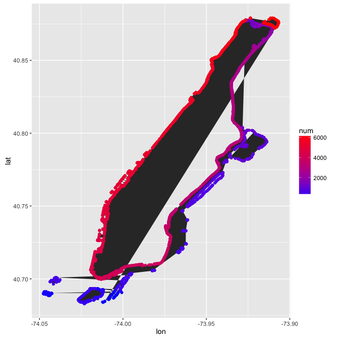
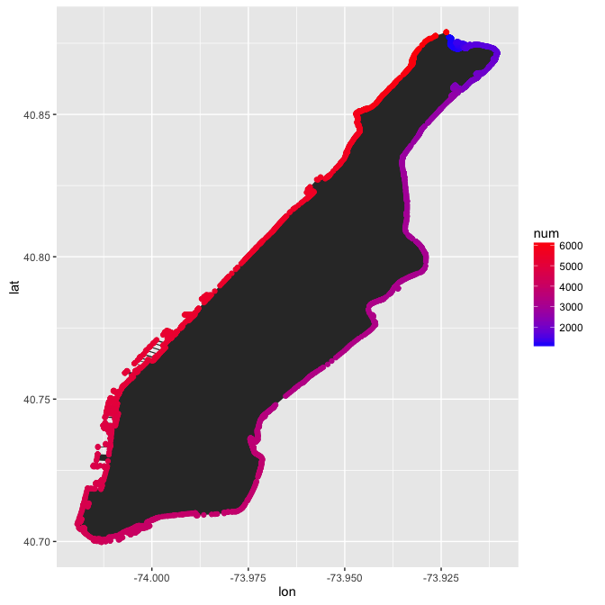
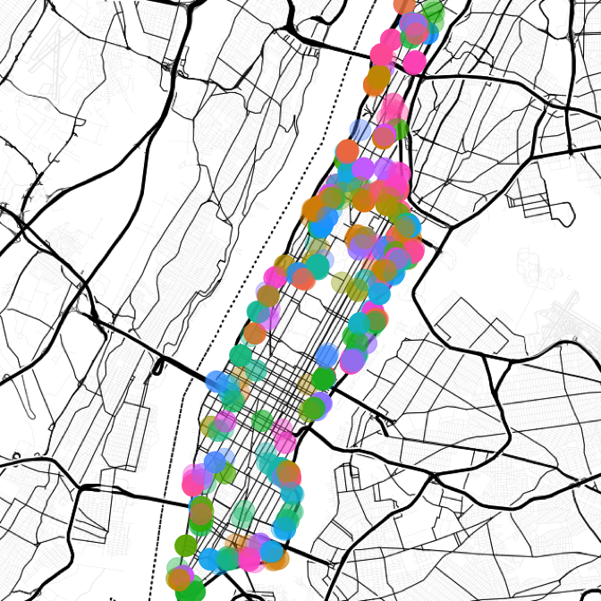

# Revised
Joe Willage  
April 14, 2016  


This is the third and final(?) installment in a series discussing trees and geocoordinate accuracy in New York City. The [first article]() established a baseline and connected to the NYC Tree Map data source[^1]. The [second article]() focused on achieving a higher accuracy in mapping points to street blocks. This article brings the other two together, applying generic coordinate mapping to the full list* of NYC trees.  

Unfortunately, the island of Manhattan doesn't fit easily into a rectangle, which is what's returned from the Tree Map API. An MBB convering Manhattan is defined, and all trees outside of that area are pruned.  


```r
library(ggmap)
library(knitr)
library(rjson)
library(dplyr)
library(tidyr)
library(sp)
```


```r
border.corner.sw.lat <- "40.7006164"
border.corner.sw.long <- "-74.020083"
border.corner.ne.lat <- "40.8778038"
border.corner.ne.long <- "-73.9085997"

treemap.url <- paste("https://tree-map.nycgovparks.org/points",
              border.corner.sw.lat, border.corner.sw.long, 
              border.corner.ne.lat, border.corner.ne.long,
              "undefined", sep = "/")
treeMap <- data.frame()
# Retrieve 1000 trees at a time
for (i in 1:87) { # ~64K trees in Manh + various trees from BK, Qns, Bx that are in the box = 87K
  raw <- fromJSON(file = paste(treemap.url, i, 1000, sep = "/"))
  tmp <- lapply(raw$item, function(x) {
    c(x$id, x$lat, x$lng, x$stumpdiameter, x$species$id)
  })
  tmpdf <- data.frame(matrix(unlist(tmp), ncol = 5, byrow = TRUE), stringsAsFactors = FALSE)
  treeMap <- rbind(treeMap, tmpdf)
}
names(treeMap)[1:5] <- c("id", "lat", "lon", "stumpDiam", "speciesId")
```


```r
head(treeMap)
```

```
##       id      lat       lon stumpDiam speciesId
## 1 165318 40.78089 -73.91049        18        56
## 2 268508 40.81959 -73.91037         6        56
## 3 286704 40.81951 -73.91040         6        56
## 4 601641 40.81381 -73.90879         5        56
## 5  69546 40.83298 -73.91731         5        89
## 6  71263 40.83952 -73.92308         3        89
```

Next, the trees are subset to just those in Manhattan. The first step is to retrieve a shape file describing Manhattan[^2].     


```r
shapes <- fromJSON(file = paste0("http://services5.arcgis.com/GfwWNkhOj9bNBqoJ/arcgis/rest/",
                                 "services/nybb/FeatureServer/0/query?where=1=1&outFields=*&",
                                 "outSR=4326&f=geojson"))
boroughs <- sapply(shapes$features, function(x) x$properties$BoroName)
manh <- which(boroughs == "Manhattan")
coords.manh <- shapes$features[[manh]]$geometry$coordinates
df.manh <- data.frame(matrix(unlist(coords.manh), ncol = 2, byrow = TRUE), stringsAsFactors = FALSE)
names(df.manh) <- c("lon", "lat")
ggplot(data = df.manh, aes(x = lon, y = lat)) +
  geom_polygon() +
  scale_x_continuous(limits = c(-74.08, -73.85))
```


This works pretty well, except for the giant line down the middle of the city causing half of Manhattan to not exist. 


```r
df.manh$num <- seq_along(df.manh$lon)
g <- ggplot(data = df.manh, aes(x = lon, y = lat, num = num)) +
      geom_polygon() + 
      geom_point(aes(color = num)) +
      scale_color_continuous(low = "blue", high = "red") 
g
```



The area of interest is the main island of Manhattan. It looks that's the polygon described by the bright red through purple points, starting and ending at Inwood. Using the legend, that appears to be about points 1100 and up (fine-tuned to this number with trial and error). The weird island floating up by the bronx should be removed as well (points > 6130) . 


```r
df.manh.subset <- subset(df.manh, num > 1100 & num < 6130)
g <- ggplot(data = df.manh.subset, aes(x = lon, y = lat, num = num)) +
      geom_polygon() + 
      geom_point(aes(color = num)) +
      scale_color_continuous(low = "blue", high = "red") 
g
```



Better.  


```r
points.manh <- point.in.polygon(treeMap$lon, treeMap$lat, 
                                df.manh.subset[, "lon"],  df.manh.subset[, "lat"])
treeMap <- treeMap[points.manh > 0, ]
```

Now that the correct points are collected, they need to be mapped to a street block, which requires simultaneously building a block table. See the [last post]() for detailed descriptions of the following functions.  


```r
user <- readLines("../../geonames.txt")
fns.url <- paste0("http://api.geonames.org/findNearbyStreetsJSON?username=", user, "&")
fni.url <- paste0("http://api.geonames.org/findNearestIntersectionJSON?username=", user, "&")

getSegments <- function(lat, lon) {
  fns.parms <- paste0("lat=", lat, "&lng=", lon)
  seg <- fromJSON(file = paste0(fns.url, fns.parms))
  seg <- sapply(seg$streetSegment, function(i) c(i$name, i$fraddl, i$fraddr, i$toaddl, i$toaddr, 
                                                i$mtfcc, i$zip, i$postalcode, i$distance, i$line))
  segments <- seg %>% t %>% as.data.frame(stringsAsFactors = FALSE) %>% 
              setNames(c("street",	"fraddl", "fraddr",	"toaddl", "toaddr",	 "mtfcc",	"zip", 
                         "distance", "line"))
  segments[, c("coord1", "coord2")] <- t(sapply(strsplit(segments$line, ","), 
                                                function(z) c(z[1], z[length(z)])))
  segments <- segments %>% separate(coord1, c("lon1", "lat1"), " ") %>% 
              separate(coord2, c("lon2", "lat2"), " ") 
  segments$id <- seq_along(segments$street)
  segments[, c(1:8, 10:14)]
} 

getStreet <- function(primary, intersection) {
  streets <- c(intersection$street1, intersection$street2)
  street <- streets[streets != primary]
  if (length(street) > 1) {
   street <- paste(street, collapse = " & ")
  }  
  street
}

# seed blocks table with correct data types
blocks <- data.frame(id = 1, primary.street = "Clinton St", cross1.segment = 1, 
                     cross1.street = "E Broadway", cross1.lat = "40.715952", 
                     cross1.lon = "-73.986721", cross2.segment = 1, cross2.street = "Grand St",
                     cross2.lat = "40.715952", cross2.lon = "-73.986721", count = 0, 
                     stringsAsFactors = FALSE)
err <- NULL
tmpBlock <- NULL
treeMap$blockId <- NULL
for (tree in 1:nrow(treeMap)) { 
  tryCatch({
  segments <- getSegments(treeMap[tree, "lat"], treeMap[tree, "lon"])
  primary <- segments[1, "street"]
  tmpBlock <- data.frame()
  for (segment in 1 : nrow(segments)) {
    if (segments[segment, "street"] != primary) {
      next
    }
    fni.parms1 <- paste0("lat=", segments[segment, "lat1"], 
                         "&lng=", segments[segment, "lon1"])
    int1 <- fromJSON(file = paste0(fni.url, fni.parms1))
    fni.parms2 <- paste0("lat=", segments[segment, "lat2"], 
                         "&lng=", segments[segment, "lon2"])
    int2 <- fromJSON(file = paste0(fni.url, fni.parms2))

    if (segment == 1) {
      primary.int1 <- int1
      primary.int2 <- int2
    }

    if (int1$intersection$distance < 0.001) {
      tmpBlock <- rbind(tmpBlock, 
                        data.frame(segment, street = getStreet(primary, int1$intersection),
                                   lat = int1$intersection$lat, lon = int1$intersection$lng, 
                                   stringsAsFactors = FALSE))
    } 
    if (int2$intersection$distance < 0.001) {
      tmpBlock <- rbind(tmpBlock, 
                        data.frame(segment, street = getStreet(primary, int2$intersection),
                                   lat = int2$intersection$lat, lon = int2$intersection$lng, 
                                   stringsAsFactors = FALSE))
    } 
    if (nrow(tmpBlock) > 2) {
      # error state with incomplete segments. Use primary segment for full block
       tmpBlock <- rbind(data.frame(1, street = getStreet(primary, primary.int1$intersection),
                                    lat = int1$intersection$lat, lon = int1$intersection$lng, 
                                    stringsAsFactors = FALSE),
                         data.frame(1, street = getStreet(primary, primary.int2$intersection),
                                    lat = int1$intersection$lat, lon = int1$intersection$lng, 
                                    stringsAsFactors = FALSE))       
     }
     if (nrow(tmpBlock) == 2) {
       minStreet <- which(tmpBlock$street == min(tmpBlock$street))
       if (length(minStreet) > 1) {
         tmpBlock <- cbind(tmpBlock[1, ], "NA", "NA", "NA", "NA")
       } else{
         tmpBlock <- cbind(tmpBlock[minStreet, ], tmpBlock[-minStreet, ])
       }
       names(tmpBlock) <- c("cross1.segment", "cross1.street", "cross1.lat", "cross1.lon",
                            "cross2.segment", "cross2.street", "cross2.lat", "cross2.lon")
       break
     } 
  }
  if (is.null(tmpBlock$cross1.segment) | is.null(tmpBlock$cross2.segment)) {
    err <<- c(err, tree)
    tmpBlock <- NULL
    next
  }
  x <- inner_join(tmpBlock, blocks, 
                  by = c("cross1.lat" = "cross1.lat", "cross1.lon" = "cross1.lon",
                         "cross2.lat" = "cross2.lat", "cross2.lon" = "cross2.lon"))
  if (nrow(x) > 0) {
    # block exists
    blocks[blocks$id == x$id, "count"] <- blocks[blocks$id == x$id, "count"] + 1
    treeMap[tree, "blockId"] <- blocks[blocks$id == x$id, "id"]
  } else{
    blocks <- rbind(blocks, 
                    cbind(id = nrow(blocks) + 1, primary.street = primary, tmpBlock, count = 1))
    treeMap[tree, "blockId"] <- nrow(blocks)
  }},
  error = function(e){
    Sys.sleep(60*30)
    tree <- tree - 1
    print(paste("continuing at", timestamp(quiet = T)))
  }
)
}
```


```r
length(err) 
```

```
## [1] 925
```

There are a lot of errors, but not too bad relative to the total number of trees mapped (1.44%). The previous post introduced k-means clustering to group a block of trees together. The clustering method helps reduce the amount of manual labor, but the number of clusters has to be conservative, and clusters have to be verified. The starting number of clusters is obtained by dividing the number of errors by the median number of trees per block, resulting in 185 clusters. The idea is that each cluster will map to a block.


```r
map.manh <- get_map(location = "manhattan", zoom = 12, maptype = "toner-lines")
trees.err <- treeMap[err, ]
set.seed(123)
km <- kmeans(cbind(trees.err[, "lat"], trees.err[, "lon"]), 
             centers = ceiling(length(err)/median(blocks$count)), nstart = 50)
trees.err$cluster <- as.factor(km$cluster)
ggmap(map.manh) + 
   geom_point(data = trees.err,
              aes(x = lon, y = lat, color = cluster), alpha = 0.4, size = 8) +
   theme_nothing() 
```




[^1]: **New York City Street Tree Map Beta**  
  Interactive map to view details from a city-wide to a single tree level. No official API  
  https://tree-map.nycgovparks.org/points/\<SW lat>\/\<SW lng\>/\<NE lat\>/\<NE lng\>/undefined/
  \<page\>/\<number trees\>  
  View details of a specific tree, including closest address:  
  https://tree-map.nycgovparks.org/tree/full/\<tree-id from points json\>  
  Browser-based map:  
  https://tree-map.nycgovparks.org/ &nbsp;&nbsp;&nbsp;
  
[^2]: **NYC Open Data**  
  Political and Administrative Boundaries, Borough Boundaries (Clipped to Shoreline)
  http://www1.nyc.gov/site/planning/data-maps/open-data/districts-download-metadata.page&nbsp;&nbsp;&nbsp;
