# Revised
Joe Willage  
May 9, 2016  


```r
map.tbc <- get_map(location = "40.7197778,-74.0084906", zoom = 16, maptype = "toner-lines")
ggmap(map.tbc) + 
   geom_point(data = trees.err,
              aes(x = lon, y = lat, color = cluster), alpha = 0.4, size = 8) +
   geom_text(data = means, aes(x = lon, y = lat, label = cluster), size = 7, color = "red4", 
             alpha = 0.8) +
   theme_nothing() 
```

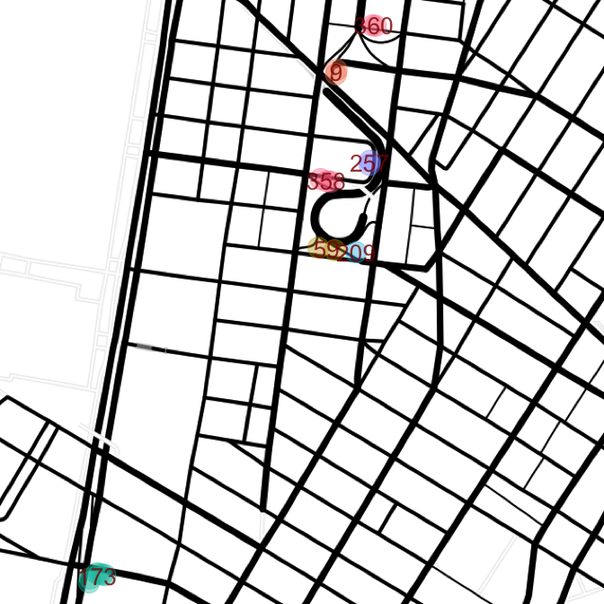


```r
map.x <- get_map(location = "40.729319,-74.0043346", zoom = 16, maptype = "toner-lines")
ggmap(map.x) + 
   geom_point(data = trees.err,
              aes(x = lon, y = lat, color = cluster), alpha = 0.4, size = 8) +
   geom_text(data = means, aes(x = lon, y = lat, label = cluster), size = 8, color = "red4", 
             alpha = 0.8) +
   theme_nothing()
```

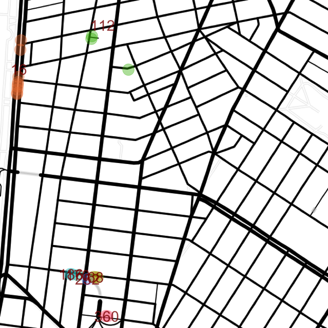


```r
km <- kmeans(cbind(trees.err[trees.err$cluster == 16, "lat"], trees.err[trees.err$cluster ==16, "lon"]), 
             centers = 3, nstart = 50)
trees.err$cluster2 <- NULL
trees.err[trees.err$cluster ==16, "cluster2"] <- as.factor(km$cluster)
means <- trees.err %>% group_by(cluster) %>% summarize(lat = mean(lat), lon = mean(lon))
means2 <- trees.err %>% group_by(cluster2) %>% summarize(lat = mean(lat), lon = mean(lon))
map.x <- get_map(location = "40.730319,-74.0043346", zoom = 16, maptype = "toner-lines")
ggmap(map.x) + 
   geom_point(data = trees.err,
              aes(x = lon, y = lat, color = cluster), alpha = 0.4, size = 8) +
   geom_text(data = means, aes(x = lon, y = lat, label = cluster), size = 20, color = "red4", 
             alpha = 0.8) +
    geom_text(data = means2, aes(x = lon, y = lat, label = cluster2), size = 20, color = "blue4", 
             alpha = 0.8) +
   theme_nothing()
```

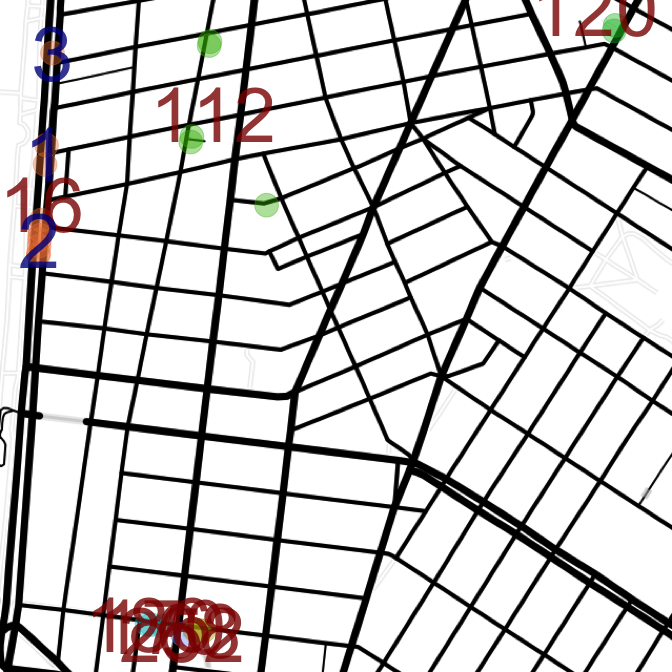


```r
map.holland <- get_map(location = "40.7258421,-74.0088331", zoom = 17, maptype = "toner-lines")
ggmap(map.holland) + 
   geom_point(data = trees.err,
              aes(x = lon, y = lat, color = cluster), alpha = 0.4, size = 8) +
   geom_text(data = means, aes(x = lon, y = lat, label = cluster), size = 8, color = "red4", 
             alpha = 0.8) +
   theme_nothing()
```

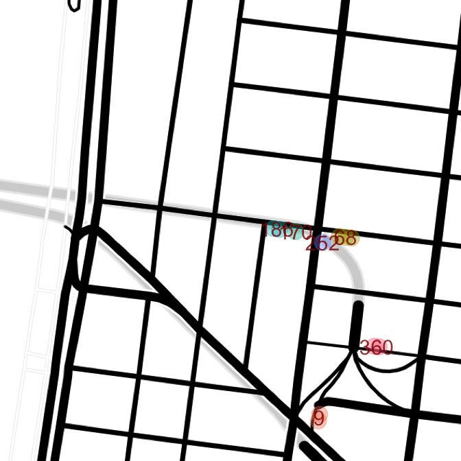


```r
map.x <- get_map(location = "40.7415998,-74.0037806", zoom = 16, maptype = "toner-lines")
ggmap(map.x) + 
   geom_point(data = trees.err,
              aes(x = lon, y = lat, color = cluster), alpha = 0.4, size = 8) +
   geom_text(data = means, aes(x = lon, y = lat, label = cluster), size = 20, color = rainbow(370), 
             alpha = 0.8) +
   theme_nothing()
```

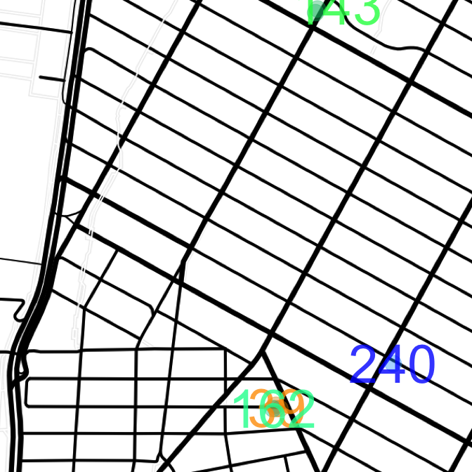


```r
map.x <- get_map(location = "40.7512192,-74.0001704", zoom = 16, maptype = "toner-lines")
ggmap(map.x) + 
   geom_point(data = trees.err,
              aes(x = lon, y = lat, color = cluster), alpha = 0.4, size = 8) +
   geom_text(data = means, aes(x = lon, y = lat, label = cluster), size = 20, color = rainbow(370), 
             alpha = 0.8) +
   theme_nothing()
```

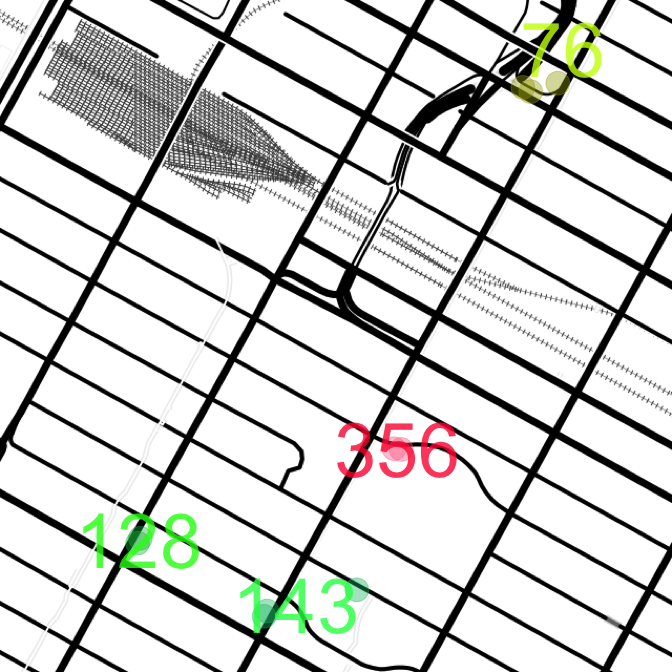


```r
map.x <- get_map(location = "40.7837968,-73.9814432", zoom = 17, maptype = "toner-lines")
d <- trees.err
d<- d[!d$cluster %in% c(338, 123, 165),]
means <- d %>% group_by(cluster) %>% summarize(lat = mean(lat), lon = mean(lon))
ggmap(map.x) + 
   geom_point(data = d,
              aes(x = lon, y = lat, color = cluster), alpha = 0.4, size = 8) +
   geom_text(data = means, aes(x = lon, y = lat, label = cluster), size = 20, color = rainbow(367), 
             alpha = 0.8) +
   theme_nothing()
```

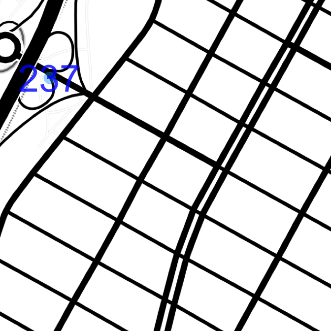


```r
map.x <- get_map(location = "40.7904341,-73.9719176", zoom = 17, maptype = "toner-lines")
d <- trees.err
d <- d[!d$cluster %in% c(265, 26, 134, 227, 303, 226, 203, 190), ]
means <- trees.err %>% group_by(cluster) %>% summarize(lat = mean(lat), lon = mean(lon))
ggmap(map.x) + 
   geom_point(data = trees.err,
              aes(x = lon, y = lat, color = cluster), alpha = 0.4, size = 8) +
   geom_text(data = means, aes(x = lon, y = lat, label = cluster), size = 4, color = "red4", 
             alpha = 0.8) +
   theme_nothing()
```

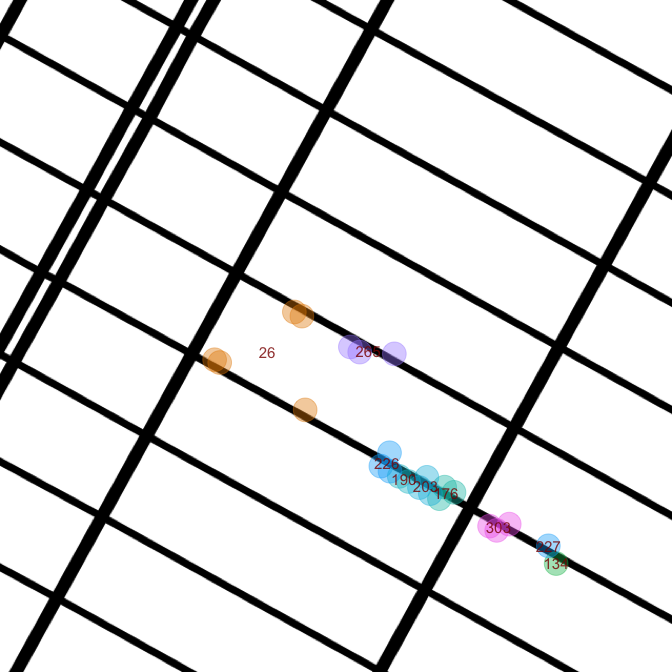


```r
map.x <- get_map(location = "40.8227769,-73.9517196", zoom = 16, maptype = "toner-lines")
d <- trees.err
d<- d[!d$cluster %in% c(79, 336), ]
means <- d %>% group_by(cluster) %>% summarize(lat = mean(lat), lon = mean(lon))
ggmap(map.x) + 
   geom_point(data = d,
              aes(x = lon, y = lat, color = cluster), alpha = 0.4, size = 8) +
   geom_text(data = means, aes(x = lon, y = lat, label = cluster), size = 5, color = "red4", 
             alpha = 0.8) +
   theme_nothing()
```

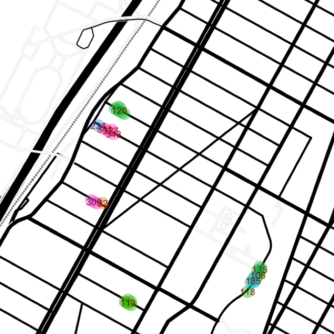


```r
map.x <- get_map(location = "40.8040861,-73.9681536", zoom = 17, maptype = "toner-lines")
#d <- trees.err
#d<- d[!d$cluster %in% c(79, 336),]
means <- d %>% group_by(cluster) %>% summarize(lat = mean(lat), lon = mean(lon))
ggmap(map.x) + 
   geom_point(data = d,
              aes(x = lon, y = lat, color = cluster), alpha = 0.4, size = 8) +
   geom_text(data = means, aes(x = lon, y = lat, label = cluster), size = 5, color = "red4", 
             alpha = 0.8) +
   theme_nothing()
```

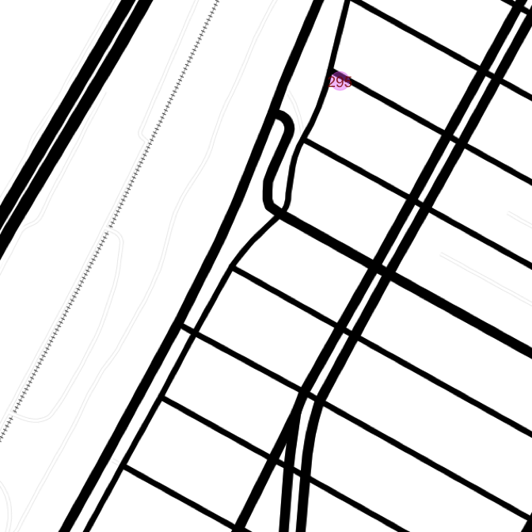


```r
map.x <- get_map(location = "40.8097175,-73.9628462", zoom = 17, maptype = "toner-lines")
#d <- trees.err
#d<- d[!d$cluster %in% c(79, 336),]
means <- d %>% group_by(cluster) %>% summarize(lat = mean(lat), lon = mean(lon))
ggmap(map.x) + 
   geom_point(data = trees.err,
              aes(x = lon, y = lat, color = cluster), alpha = 0.4, size = 8) +
   geom_text(data = means, aes(x = lon, y = lat, label = cluster), size = 5, color = "red4", 
             alpha = 0.8) +
   theme_nothing()
```

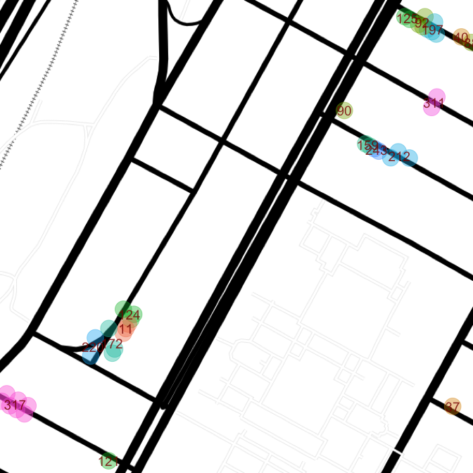


```r
map.x <- get_map(location = "40.8130144,-73.9587264", zoom = 17, maptype = "toner-lines")
#d <- trees.err
#d<- d[!d$cluster %in% c(79, 336),]
means <- d %>% group_by(cluster) %>% summarize(lat = mean(lat), lon = mean(lon))
ggmap(map.x) + 
   geom_point(data = trees.err,
              aes(x = lon, y = lat, color = cluster), alpha = 0.4, size = 8) +
   geom_text(data = means, aes(x = lon, y = lat, label = cluster), size = 5, color = "red4", 
             alpha = 0.8) +
   theme_nothing()
```

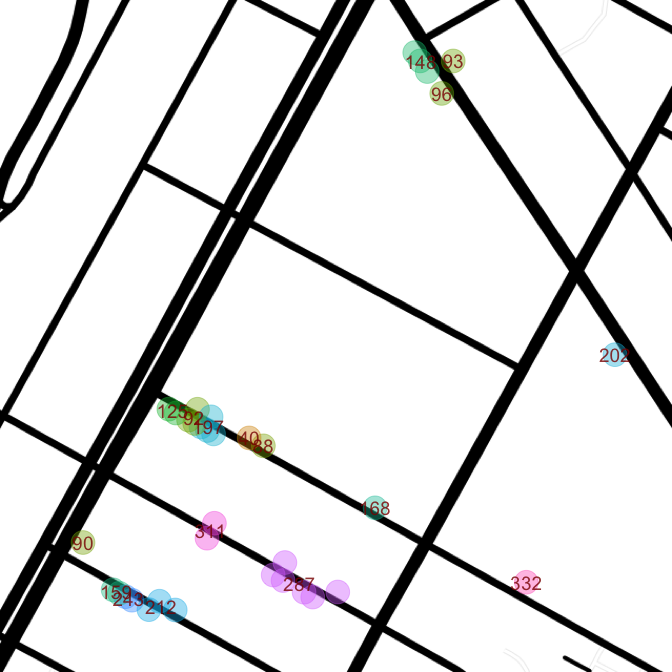


```r
map.x <- get_map(location = "40.8190853,-73.9516904", zoom = 16, maptype = "toner-lines")
#d <- trees.err
#d<- d[!d$cluster %in% c(79, 336),]
means <- d %>% group_by(cluster) %>% summarize(lat = mean(lat), lon = mean(lon))
ggmap(map.x) + 
   geom_point(data = trees.err,
              aes(x = lon, y = lat, color = cluster), alpha = 0.4, size = 8) +
   geom_text(data = means, aes(x = lon, y = lat, label = cluster), size = 5, color = "red4", 
             alpha = 0.8) +
   theme_nothing()
```

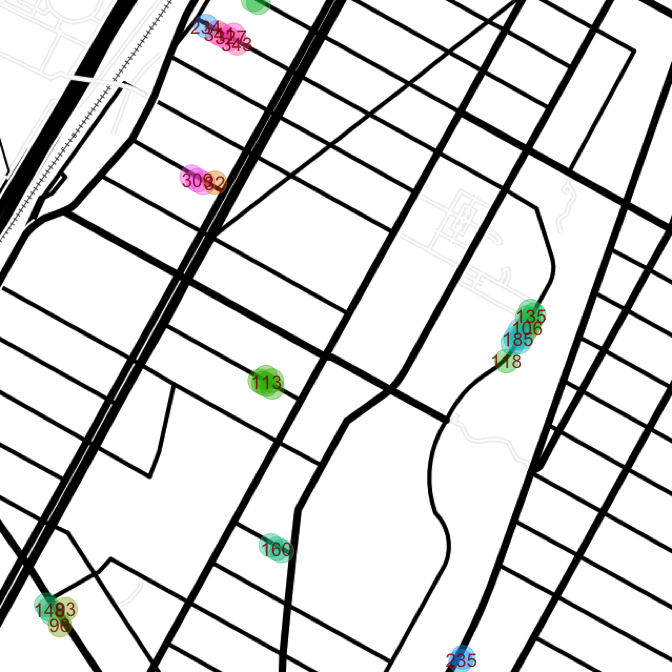


```r
map.x <- get_map(location = "40.8643326,-73.9272553", zoom = 15, maptype = "toner-lines")
#d <- trees.err
#d<- d[!d$cluster %in% c(79, 336),]
#means <- d %>% group_by(cluster) %>% summarize(lat = mean(lat), lon = mean(lon))
ggmap(map.x) + 
   geom_point(data = trees.err,
              aes(x = lon, y = lat, color = cluster), alpha = 0.4, size = 8) +
   geom_text(data = means, aes(x = lon, y = lat, label = cluster), size = 5, color = "red4", 
             alpha = 0.8) +
   theme_nothing()
```

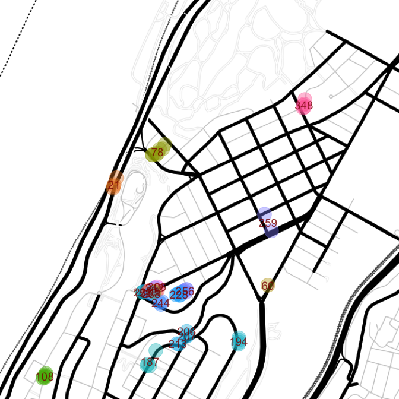


```r
map.x <- get_map(location = "40.860216,-73.9304092", zoom = 17, maptype = "toner-lines")
#d <- trees.err
#d<- d[!d$cluster %in% c(79, 336),]
#means <- d %>% group_by(cluster) %>% summarize(lat = mean(lat), lon = mean(lon))
ggmap(map.x) + 
   geom_point(data = trees.err,
              aes(x = lon, y = lat, color = cluster), alpha = 0.4, size = 8) +
   geom_text(data = means, aes(x = lon, y = lat, label = cluster), size = 5, color = "red4", 
             alpha = 0.8) +
   theme_nothing()
```

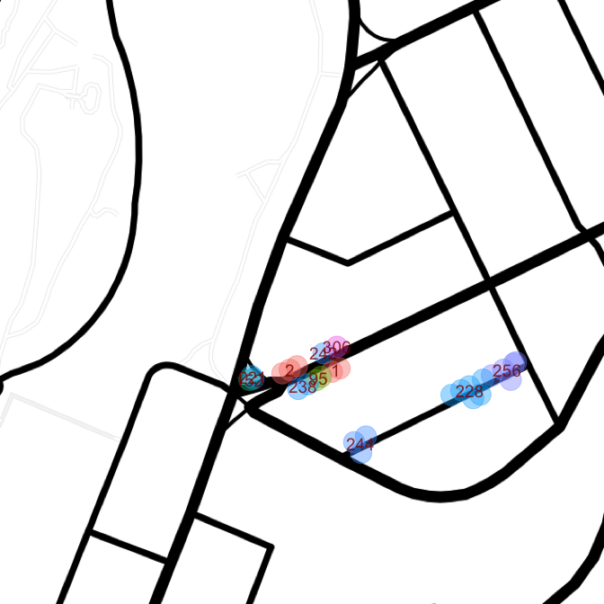


```r
map.x <- get_map(location = "40.8488306,-73.9317689", zoom = 17, maptype = "toner-lines")
ggmap(map.x) + 
   geom_point(data = trees.err,
              aes(x = lon, y = lat, color = cluster), alpha = 0.4, size = 8) +
   geom_text(data = means, aes(x = lon, y = lat, label = cluster), size = 5, color = "red4", 
             alpha = 0.8) +
   theme_nothing()
```

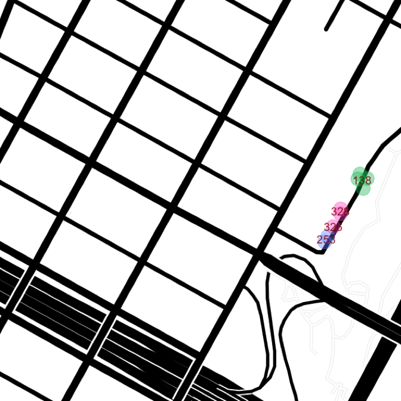


```r
map.x <- get_map(location = "40.8278474,-73.9419416", zoom = 17, maptype = "toner-lines")
ggmap(map.x) + 
   geom_point(data = trees.err,
              aes(x = lon, y = lat, color = cluster), alpha = 0.4, size = 8) +
   geom_text(data = means, aes(x = lon, y = lat, label = cluster), size = 5, color = "red4", 
             alpha = 0.8) +
   theme_nothing()
```

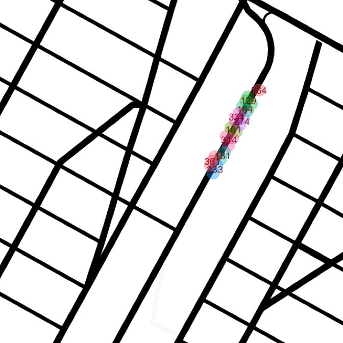


```r
map.x <- get_map(location = "40.8150564,-73.937090", zoom = 17, maptype = "toner-lines")
ggmap(map.x) + 
   geom_point(data = trees.err,
              aes(x = lon, y = lat, color = cluster), alpha = 0.4, size = 8) +
   geom_text(data = means, aes(x = lon, y = lat, label = cluster), size = 5, color = "red4", 
             alpha = 0.8) +
   theme_nothing()
```

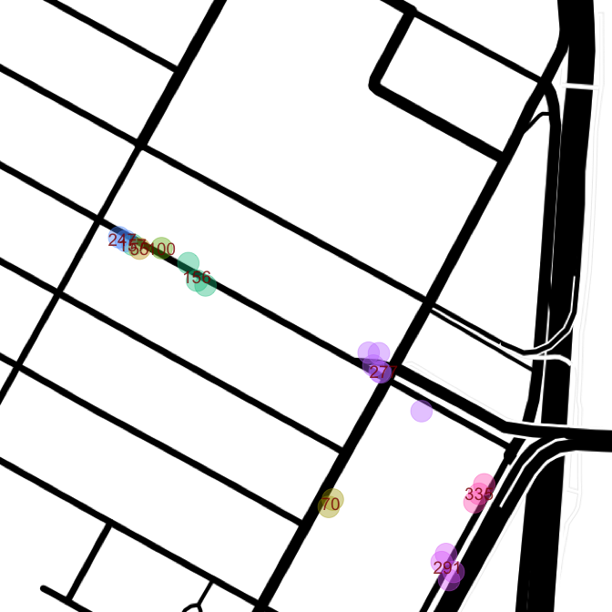


```r
map.x <- get_map(location = "40.8032072,-73.9326803", zoom = 17, maptype = "toner-lines")
ggmap(map.x) + 
   geom_point(data = trees.err,
              aes(x = lon, y = lat, color = cluster), alpha = 0.4, size = 8) +
   geom_text(data = means, aes(x = lon, y = lat, label = cluster), size = 5, color = "red4", 
             alpha = 0.8) +
   theme_nothing()
```

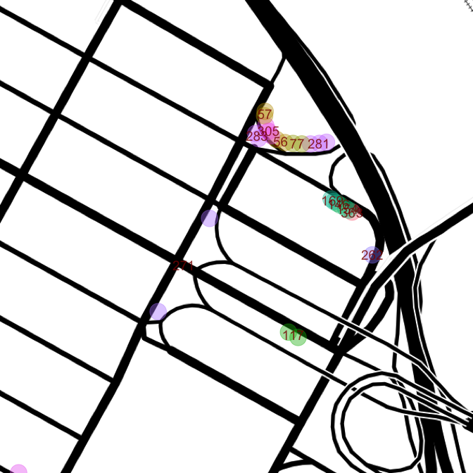
