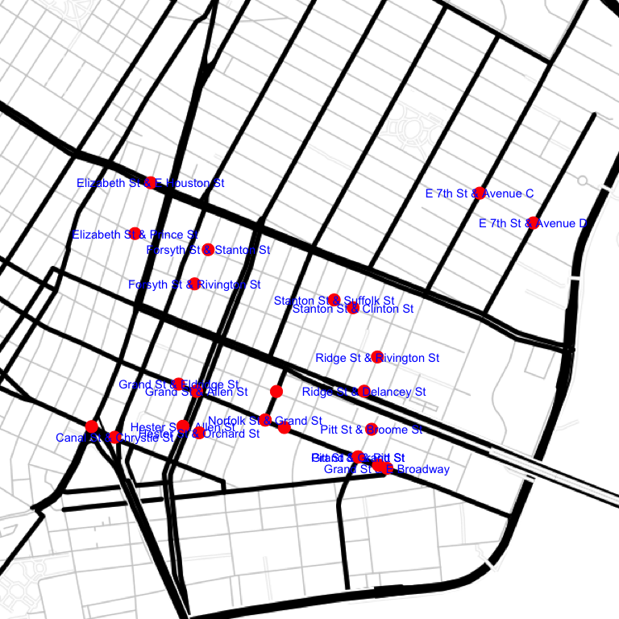
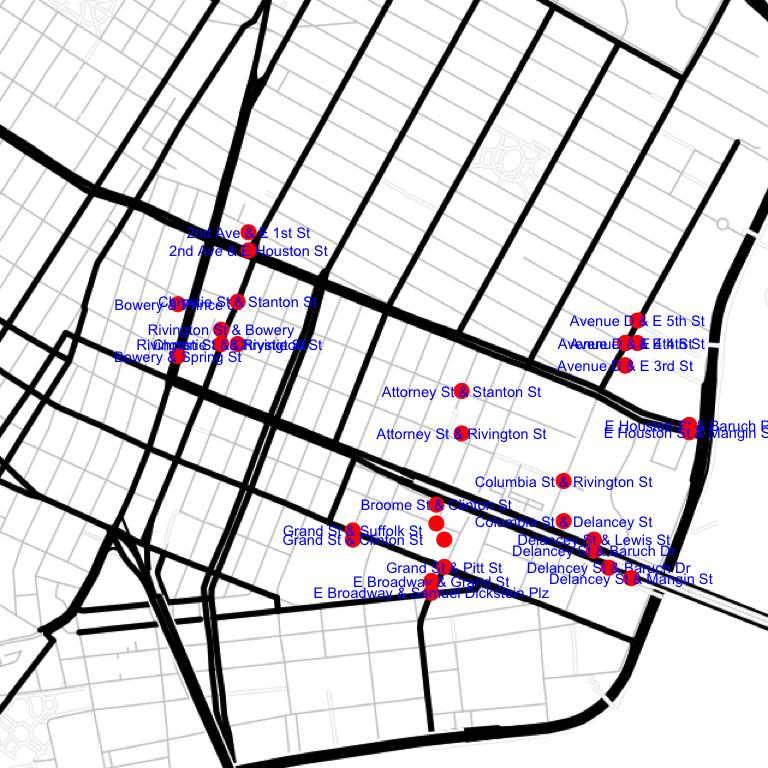
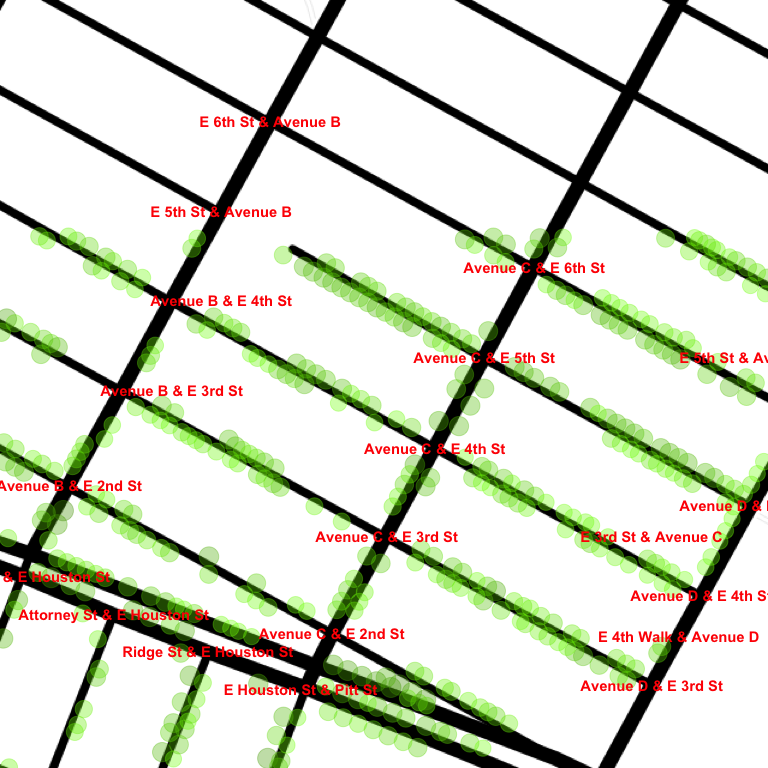

# Setup
Joe Willage  
March 23, 2016  


Data is pulled from the NYC Street Tree Map site (see sources file). The call takes in diagonal 
points and creates an MBB using those points as the southwest and northeast corners. The coordinates
below roughly describe a rectangle between the Manhattan bridge up to 8th and D. This is a 
reasonable area to start with while everything gets checked out and validated. 


```r
border.corner.sw.lat <- "40.71455760597046"
border.corner.sw.long <- "-73.99566650390625"
border.corner.ne.lat <- "40.723713744687295"
border.corner.ne.long <- "-73.97626876831055"

treemap.url <- paste("https://tree-map.nycgovparks.org/points",
              border.corner.sw.lat, border.corner.sw.long, 
              border.corner.ne.lat, border.corner.ne.long,
              "undefined", "1", "2000", sep = "/")
raw <- fromJSON(file = treemap.url)
```

The json returned includes the latitude and longitude for each tree in the range, as well as the 
tree species, trunk diameter, and a few other data points. At this point the data is trimmed down
from 1976 to a sample of 20 trees. These 20 will be used for validation. 


```r
samp <- raw$item[1:20]
```


```r
samp[[1]]
```

```
## $id
## [1] 236951
## 
## $lat
## [1] 40.72351
## 
## $lng
## [1] -73.99377
## 
## $species
## $species$id
## [1] 89
## 
## $species$scientificName
## [1] "Acer campestre"
## 
## $species$commonName
## [1] "Hedge Maple"
## 
## $species$name
## [1] "Acer campestre - hedge maple"
## 
## $species$code
## [1] "ACPL"
## 
## $species$genusId
## [1] 31
## 
## $species$imagePath
## NULL
## 
## $species$libraryLink
## NULL
## 
## $species$trees
## NULL
## 
## $species$numberOfTrees
## NULL
## 
## $species$color
## [1] "#76BF54"
## 
## $species$description
## [1] "<p>Acer campestre, common name field maple, is a maple native to England and much of Europe, north to southern Scotland (where it is the only native maple), Denmark, Poland and Belarus, and also southwest Asia from Turkey to the Caucasus, and north Africa in the Atlas Mountains. In North America it is known as hedge maple and in Australia, it is sometimes called common maple.</p><p>It is a deciduous tree reaching 15-25 metres (49-82 ft) tall, with a trunk up to 1 metre (3 ft 3 in) in diameter, with finely fissured, often somewhat corky bark. The shoots are brown, with dark brown winter buds. The leaves are in opposite pairs, 5-16 centimetres (2.0-6.3 in) long (including the 3-9 centimetres (1.2-3.5 in) petiole) and 5-10 centimetres (2.0-3.9 in) broad, with five blunt, rounded lobes with a smooth margin. Usually monoecious, the flowers are produced in spring at the same time as the leaves open, yellow-green, in erect clusters 4-6 centimetres (1.6-2.4 in) across, and are insect-pollinated. The fruit is a samara with two winged achenes aligned at 180چ, each achene is 8-10 millimetres (0.31-0.39 in) wide, flat, with a 2 centimetres (0.79 in) wing.</p>\r"
## 
## 
## $stumpdiameter
## [1] 5
```


The ArcGIS API is used to reverse geocode each data point. It returns the closest address to each
tree.  


```r
gis.url <- paste0("http://geocode.arcgis.com/arcgis/rest/services/World/GeocodeServer/",
                 "reverseGeocode?f=json&location=")
treeMap <- lapply(samp, function(i) {
  address <- fromJSON(file = paste0(gis.url, i$lng, ",", i$lat))
  c(i$id, i$lat, i$lng, i$stumpdiameter, address$address$Match_addr)
  })

treeMap <- data.frame(matrix(unlist(treeMap.raw), ncol = 5, byrow = TRUE), stringsAsFactors = FALSE)
treeMap$X5 <- gsub(", (New York|Knickerbocker), New York", "", treeMap$X5)
treeMap <- treeMap %>% separate(col = X5, into = c("address", "zip"), sep = ", ") %>% 
                    separate(col = address, into = c("number", "street"), extra = "merge")
names(treeMap)[1:4] <- c("id", "lat", "lon", "stumpDiam")
treeMap$stumpDiam <- as.numeric(treeMap$stumpDiam)
treeMap$number <- as.numeric(treeMap$number)
treeMap$lat <- as.numeric(treeMap$lat)
treeMap$lon <- as.numeric(treeMap$lon)
```


```r
head(treeMap)
```

```
##       id      lat       lon stumpDiam number       street   zip
## 1 236951 40.72351 -73.99377         5    248 Elizabeth St 10012
## 2 248206 40.71810 -73.97664         8    140    Baruch Pl 10002
## 3 241049 40.71762 -73.99189         6    294     Grand St 10002
## 4 231671 40.72059 -73.98520         7    154   Stanton St 10002
## 5 238786 40.71582 -73.98400        10     10      Pitt St 10002
## 6 242345 40.72328 -73.97685        11    279     E 7th St 10009
```

The next thing to do is build a reference table consisting of all the blocks, which are defined 
as street segments between two adjacent intersecting streets. The Census geocoding services 
provides start and end addresses for a block. Each tree has it's address looked up in the block 
table. If there is no row whose address range includes the tree, a new block will be added via the
add block function. 


```r
census.url <- "http://geocoding.geo.census.gov/geocoder/locations/address?"
# seed block table with correct data types
blocks <- data.frame(id = 1, start = 222, end = 276, street = "Elizabeth St", 
                     cross1 = "Prince St", cross1.lat = 40.722725, cross1.lon = -73.994156,
                     cross2 = "E Houston St", cross2.lat = 40.724434, cross2.lon = -73.99346, 
                     zip = "10012", count = 0, stringsAsFactors = FALSE)
treeMap$blockId <- NULL
addBlockErr <- NULL
for (i in 1 : nrow(treeMap)) {
  x <- inner_join(treeMap[i, ], blocks, by = c("street" = "street", "zip" = "zip"))
  if (nrow(x) > 0) {
    y <- x$start <= unique(x$number) & x$end >= unique(x$number)
    if (sum(y)) {
      # Taking only first match, not differentiating between sides of street
      blocks[x[which(y)[1], "id.y"], "count"] <- blocks[x[which(y)[1], "id.y"], "count"] + 1
      treeMap[i, "blockId"] <-  x[which(y)[1], "id.y"]
    } else {
      blocks <- rbind(blocks,  addBlock(treeMap[i, ]))
      treeMap[i, "blockId"] <- max(blocks$id)
    }
  }
  else{
    blocks <- rbind(blocks,  addBlock(treeMap[i, ]))
    treeMap[i, "blockId"] <- max(blocks$id)
  } 
}
```


```r
addBlock <- function(tree) {
  tryCatch({
    census.parms <- paste0("street=", tree$number, "+", 
                        gsub(" ", "+", tree$street), "&zip=", tree$zip, 
                        "&city=new+york&state=NY&benchmark=9&format=json")
    result <- fromJSON(file = paste0(census.url, census.parms))
    from <- as.numeric(result$result$addressMatches[[1]]$addressComponents$fromAddress)
    to <- as.numeric(result$result$addressMatches[[1]]$addressComponents$toAddress)
    from.parms <- paste0("street=", from, "+", 
                         gsub(" ", "+", tree$street), "&zip=", tree$zip, 
                         "&city=new+york&state=NY&benchmark=9&format=json")
    to.parms <- paste0("street=", to, "+", 
                       gsub(" ", "+", tree$street), "&zip=", tree$zip, 
                       "&city=new+york&state=NY&benchmark=9&format=json")
    fromCoord <- fromJSON(file = paste0(census.url, from.parms))
    toCoord <- fromJSON(file = paste0(census.url, to.parms))
    fromInt <- fromJSON(file = paste0(gis.url, fromCoord$result$addressMatches[[1]]$coordinates$x, 
                                      ",", fromCoord$result$addressMatches[[1]]$coordinates$y,
                                      "&returnIntersection=true"))
    toInt <- fromJSON(file = paste0(gis.url, toCoord$result$addressMatches[[1]]$coordinates$x, 
                                    ",", toCoord$result$addressMatches[[1]]$coordinates$y,
                                    "&returnIntersection=true"))
    if (grepl(tree$street, fromInt$address$Address)) {
      cross1 <- gsub(tree$street, "", fromInt$address$Address)
      cross1 <- gsub(" & ", "", cross1)
    } else{
      warning("Intersection does not include original street")
    }
    if (grepl(tree$street, toInt$address$Address)) {
      cross2 <- gsub(tree$street, "", toInt$address$Address)
      cross2 <- gsub(" & ", "", cross2)
    } else{
      warning("Intersection does not include original street")
    }
    # order so multiple segment entries will match
    fromCross <- min(cross1, cross2)
    toCross <- max(cross1, cross2)
    gis.url.parms1 <- URLencode(paste0(tree$street, " and ", fromCross, ", nyc"))
    coords.cross1 <- paste0(gis.url.find, "&text=", gis.url.parms1)
    gis.url.parms2 <- URLencode(paste0(tree$street, " and ", toCross, ", nyc"))
    coords.cross2 <- paste0(gis.url.find, "&text=", gis.url.parms2)
    coords.cross1 <- fromJSON(file = coords.cross1)
    coords.cross2 <- fromJSON(file = coords.cross2)
    tmp <- data.frame(id = nrow(blocks) + 1, start = min(from, to), end = max(from, to), 
                      street = tree$street, cross1 = fromCross, 
                      cross1.lat = coords.cross1$locations[[1]]$feature$geometry$y,
                      cross1.lon = coords.cross1$locations[[1]]$feature$geometry$x,
                      cross2 = toCross,
                      cross2.lat = coords.cross2$locations[[1]]$feature$geometry$y,
                      cross2.lon = coords.cross2$locations[[1]]$feature$geometry$x,
                      zip = tree$zip, count = 1, stringsAsFactors = FALSE)
    tmp},
    error = function(err) {
      addBlockErr <<- c(addBlockErr, tree$id)
      tmp <- data.frame(id = nrow(blocks) + 1, start = min(from, to), end = max(from, to), 
                        street = tree$street, 
                        cross1 = NA, cross1.lat = NA,cross1.lon = NA,
                        cross2 = NA, cross2.lat = NA,cross2.lon = NA,
                        zip = tree$zip, count = 1, stringsAsFactors = FALSE)
      tmp
    }
  )
}
```

This is a good point to check the validity of all the calls.  


```r
mymap <- get_map(location = "40.72017399459069,-73.98639034958494", zoom = 15, 
                 maptype = "toner-lines")
blocks$int1 = paste(blocks$street, "&", blocks$cross1)
blocks$int2 = paste(blocks$street, "&", blocks$cross2)
blocks2 <- data.frame(int2 = blocks$int2, 
                      cross2.lat = blocks$cross2.lat, 
                      cross2.lon = blocks$cross2.lon)
g <-  ggmap(mymap) + 
      theme_nothing() +
      geom_point(aes(x = cross1.lon, y = cross1.lat), data = blocks, color = "red", size = 5) +
      geom_text(aes(label = int1, x = cross1.lon, y = cross1.lat), data = blocks, color = "blue",
                check_overlap  = TRUE) +
      geom_point(aes(x = cross2.lon, y = cross2.lat), data = blocks2, color = "red",   size = 5) +
      geom_text(aes(label = int2, x = cross2.lon, y = cross2.lat), data = blocks2, color = "blue",
                 check_overlap  = TRUE)
g
```

 

Everything is lining up correctly wrt intersections. A closer point-to-point inspection reveals
minute discrepencies. For instance tree 216757 is reverse geocoded as being next to 464 Grand, but
in reality is closer to 293 E Broadway, across the street. The tree will plot correctly on the map,
but it won't fall into the correct bucket when aggregating trees by block. This is an acceptable
margin of error at this point, but in the future, there's the option to pull back the Tree Map's
address of the tree (see sources). It correctly identified the address of tree 216757, but it's 
also a lot of data to pull back for each tree, including large jpeg previws.  

The same functions are performed on the original data set of 1976 trees. 


```r
treeMap <- readRDS("treeMap.les.blocks.rds")
```


```r
summary(blocks.les)
```

```
##        id             start            end            street         
##  Min.   :  1.00   Min.   : -1.0   Min.   :  7.00   Length:248        
##  1st Qu.: 62.75   1st Qu.: 54.0   1st Qu.: 73.75   Class :character  
##  Median :124.50   Median :123.5   Median :147.00   Mode  :character  
##  Mean   :124.50   Mean   :146.8   Mean   :178.78                     
##  3rd Qu.:186.25   3rd Qu.:210.0   3rd Qu.:258.00                     
##  Max.   :248.00   Max.   :900.0   Max.   :934.00                     
##                                                                      
##     cross1            cross1.lat      cross1.lon        cross2         
##  Length:248         Min.   :40.71   Min.   :-74.00   Length:248        
##  Class :character   1st Qu.:40.72   1st Qu.:-73.99   Class :character  
##  Mode  :character   Median :40.72   Median :-73.99   Mode  :character  
##                     Mean   :40.72   Mean   :-73.99                     
##                     3rd Qu.:40.72   3rd Qu.:-73.98                     
##                     Max.   :40.72   Max.   :-73.98                     
##                     NA's   :23      NA's   :23                         
##    cross2.lat      cross2.lon         zip                count       
##  Min.   :40.71   Min.   :-74.01   Length:248         Min.   : 0.000  
##  1st Qu.:40.72   1st Qu.:-73.99   Class :character   1st Qu.: 2.000  
##  Median :40.72   Median :-73.99   Mode  :character   Median : 5.000  
##  Mean   :40.72   Mean   :-73.99                      Mean   : 7.968  
##  3rd Qu.:40.72   3rd Qu.:-73.98                      3rd Qu.:11.000  
##  Max.   :40.72   Max.   :-73.97                      Max.   :36.000  
##  NA's   :23      NA's   :23
```

```r
incomplete <- blocks.les[!complete.cases(blocks.les),]
sum(incomplete$count)
```

```
## [1] 186
```

The resulting blocks table has 246 entires, with 23 NA's. Examining one of the NA's, 1 - 99 Willett
St (id == 179), the first intersection returns correctly at Willett and Delancey. However, the other
end of the block, 99 Willett, is incorrectly reverse geocoded up at Stanton St. Those incomplete 
blocks account for 195 trees, so it will be important to fill them in. To make the manual process
easier, a subset of the `addBlock` function is broken out into the `geocodeBlockEnds` function.


```r
gis.url.find <- "http://geocode.arcgis.com/arcgis/rest/services/World/GeocodeServer/find?f=json"
geocodeBlockEnds <- function(street, cross1, cross2){
  # given cross streets, add x and y coords
  
  # order so multiple segment entries will match
  fromCross <- min(cross1, cross2)
  toCross <- max(cross1, cross2)
  gis.url.parms1 <- URLencode(paste0(street, " and ", fromCross, ", nyc"))
  coords.cross1 <- paste0(gis.url.find, "&text=", gis.url.parms1)
  gis.url.parms2 <- URLencode(paste0(street, " and ", toCross, ", nyc"))
  coords.cross2 <- paste0(gis.url.find, "&text=", gis.url.parms2)
  coords.cross1 <- fromJSON(file = coords.cross1)
  coords.cross2 <- fromJSON(file = coords.cross2)
  l <- list(street = street, 
            cross1 = list(
              street = cross1,
              y = as.numeric(coords.cross1$locations[[1]]$feature$geometry$y),
              x = as.numeric(coords.cross1$locations[[1]]$feature$geometry$x)
            ),
            cross2 = list(
              street = cross2,
              y = as.numeric(coords.cross2$locations[[1]]$feature$geometry$y),
              x = as.numeric(coords.cross2$locations[[1]]$feature$geometry$x)
            )
  )
  l
}

head(incomplete)
```

```
##    id start end    street cross1 cross1.lat cross1.lon cross2 cross2.lat
## 2   2     2 148 Baruch Pl   <NA>         NA         NA   <NA>         NA
## 6   6   231 299  E 7th St   <NA>         NA         NA   <NA>         NA
## 14 14   123 151  Canal St   <NA>         NA         NA   <NA>         NA
## 25 25   700 798  E 5th St   <NA>         NA         NA   <NA>         NA
## 29 29   260 398  E 3rd St   <NA>         NA         NA   <NA>         NA
## 34 34    37  53  Avenue B   <NA>         NA         NA   <NA>         NA
##    cross2.lon   zip count
## 2          NA 10002    14
## 6          NA 10009    25
## 14         NA 10002     2
## 25         NA 10009    31
## 29         NA 10009    36
## 34         NA 10009     4
```


```r
g <- geocodeBlockEnds("Baruch Pl", "Stanton St", "E Houston St")
blocks.les[blocks.les$id == 2, c(5:10)] <- c(g$cross1$street, g$cross1$y, g$cross2$x,
                                             g$cross2$street, g$cross2$y, g$cross2$x)
blocks.les[blocks.les$id == 2, ]
```

```
##   id start end    street     cross1       cross1.lat        cross1.lon
## 2  2     2 148 Baruch Pl Stanton St 40.7190615108811 -73.9768161138717
##         cross2       cross2.lat        cross2.lon   zip count
## 2 E Houston St 40.7181138295907 -73.9768161138717 10002    14
```

That assignment has to be repeated for each of the other 22 NAs, manually entering the correct 
cross streets. See corrections file for the full list of corrected segments. After that's finished,
the coordinates need to be convereted back to numerics.


```r
blocks.les$cross1.lat <- as.numeric(blocks.les$cross1.lat)
blocks.les$cross1.lon <- as.numeric(blocks.les$cross1.lon)
blocks.les$cross2.lat <- as.numeric(blocks.les$cross2.lat)
blocks.les$cross2.lon <- as.numeric(blocks.les$cross2.lon)
```

Further error checking for bad segments


```r
same <- blocks.les[blocks.les$cross1 == blocks.les$cross2, ]
nrow(same)
```

```
## [1] 39
```

After correcting these manually, the intersections look as follows


```r
blocks.les <- readRDS("blocks.les.sameCorrected.rds")
oldSame <- blocks.les[blocks.les$id %in% same$id, ]

oldSame$int1 = paste(oldSame$street, "&", oldSame$cross1)
oldSame$int2 = paste(oldSame$street, "&", oldSame$cross2)
oldSame2 <- data.frame(int2 = oldSame$int2, 
                      cross2.lat = oldSame$cross2.lat, 
                      cross2.lon = oldSame$cross2.lon)
g <-  ggmap(mymap) + 
      theme_nothing() +
      geom_point(aes(x = cross1.lon, y = cross1.lat), data = oldSame, color = "red", size = 5) +
      geom_text(aes(label = int1, x = cross1.lon, y = cross1.lat), data = oldSame, color = "blue",
                check_overlap  = TRUE) +
      geom_point(aes(x = cross2.lon, y = cross2.lat), data = oldSame2, color = "red",   size = 5) +
      geom_text(aes(label = int2, x = cross2.lon, y = cross2.lat), data = oldSame2, color = "blue",
                 check_overlap  = TRUE)
g
```

 

There's still some minute discrepencies, like the triangle of Grand/Clinton/E Broadway/
Samuel Dickstein. But overall the new table is still better than the one with rows having
the same cross street for both sides. 

Blocks are collapsed so both sides of the street fall into a single block. 


```r
blocks.agg <- blocks.les %>% group_by(street, cross1, cross1.lat, cross1.lon, cross2, 
                         cross2.lat, cross2.lon) %>% 
  summarize(start = min(start), end = max(end), combined = n(), trees = sum(count)) %>% 
  as.data.frame()
# Remove incomplete cases (which have a 0 count anyway)
blocks.agg <- blocks.agg[complete.cases(blocks.agg), ]
```

At this point it can be determined which blocks have the most trees. 


```r
head(blocks.agg[order(blocks.agg$trees, decreasing = TRUE), ], 10)
```

```
##         street       cross1 cross1.lat cross1.lon       cross2 cross2.lat
## 93    E 2nd St     Avenue C   40.72103  -73.98108 E Houston St   40.72038
## 96    E 3rd St     Avenue C   40.72168  -73.97823     Avenue D   40.72067
## 10    Allen St Rivington St   40.72053  -73.98983   Stanton St   40.72168
## 105   E 6th St     Avenue C   40.72350  -73.97690     Avenue D   40.72250
## 99    E 4th St     Avenue C   40.72228  -73.98017     Avenue D   40.72128
## 9     Allen St     Grand St   40.71742  -73.99143    Hester St   40.71624
## 102   E 5th St     Avenue B   40.72388  -73.98208     Avenue C   40.72289
## 103   E 5th St     Avenue C   40.72289  -73.97735     Avenue D   40.72189
## 146 Forsyth St Rivington St   40.72103  -73.99151   Stanton St   40.72218
## 91    E 2nd St     Avenue A   40.72302  -73.98574     Avenue B   40.72202
##     cross2.lon start end combined trees
## 93   -73.97977   260 398        1    36
## 96   -73.97823   260 398        1    36
## 10   -73.98926   147 177        1    34
## 105  -73.97690   701 799        1    33
## 99   -73.97779   302 398        1    32
## 9    -73.99203    39  67        1    31
## 102  -73.97973   600 698        1    31
## 103  -73.97735   700 798        1    31
## 146  -73.99091   168 192        1    30
## 91   -73.98344   153 203        1    28
```

Not surprisingly, the long blocks between avenues have the highest count of trees, all of which 
are in the East Village.


```r
map.evill <- get_map(location = "40.7228765,-73.9805015", zoom = 17, 
                 maptype = "toner-lines")
blocks.agg$int1 = paste(blocks.agg$street, "&", blocks.agg$cross1)
  
g <- ggmap(map.evill) + 
  geom_point(data = treeMap, aes(x = lon, y = lat, size = stumpDiam, color = stumpDiam),
             alpha = 0.35) +
  scale_size(range = c(5, 7)) +
  theme_nothing() +
  scale_color_continuous(low = "chartreuse", high = "chartreuse4") +
  geom_text(aes(label = int1, x = cross1.lon, y = cross1.lat), data = blocks.agg, color = "red",
                fontface = "bold", check_overlap  = TRUE)
g
```

 


