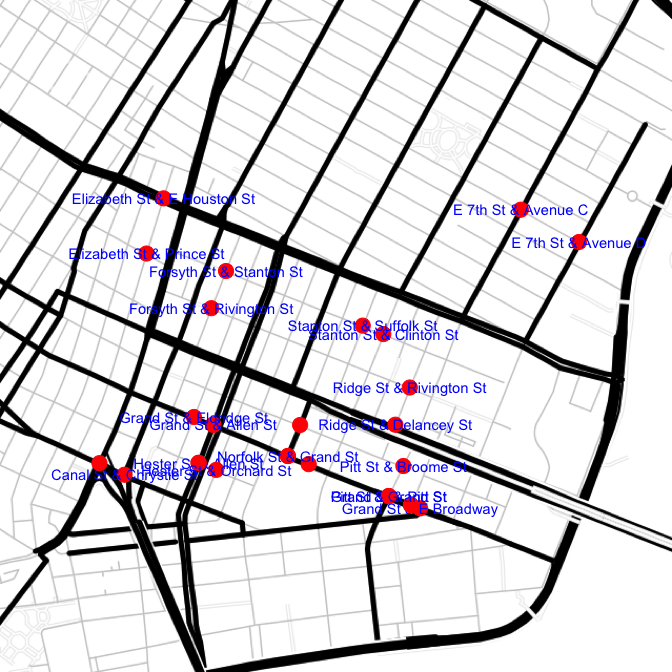
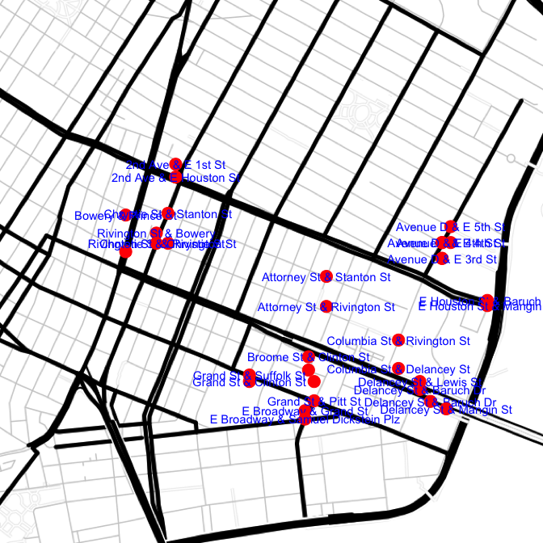
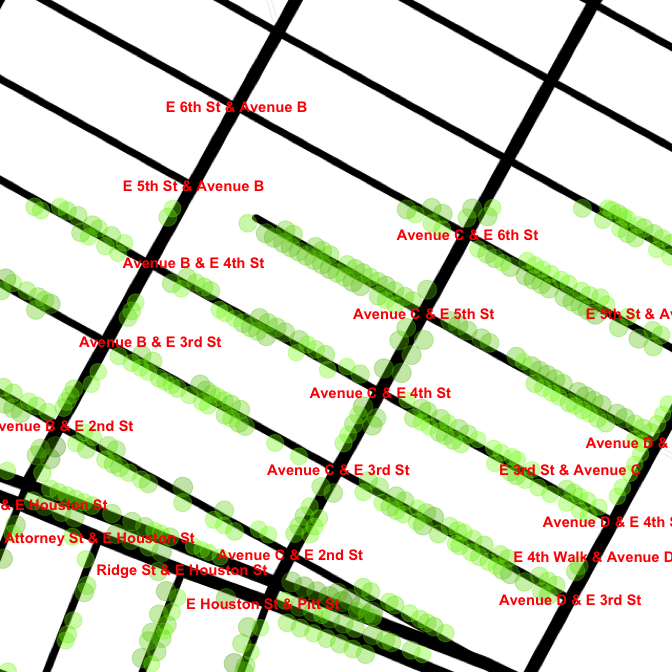
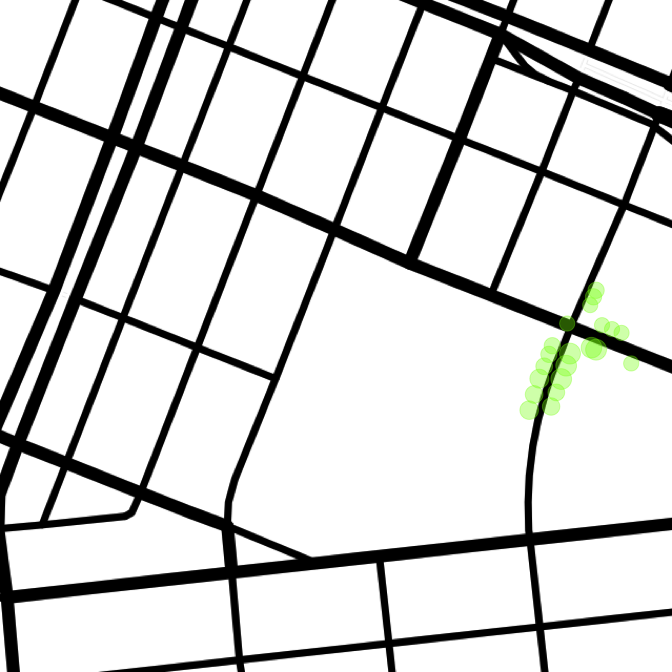
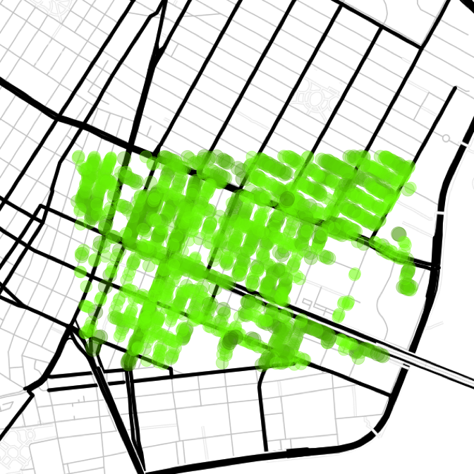

# Setup
Joe Willage  
March 23, 2016  

This is a first attempt at analyzing the NYC Street Tree Map data, specifically to find out which 
are the most tree-lined blocks.


```r
library(ggmap)
library(knitr)
library(rjson)
library(dplyr)
```


Data is pulled from the NYC Street Tree Map site[^1]. The call takes in diagonal 
points and creates an MBB using those points as the southwest and northeast corners. The coordinates
below roughly describe a rectangle between the Manhattan bridge up to 8th and D. This is a 
reasonable area to start with while everything gets checked out and validated. 


```r
border.corner.sw.lat <- "40.71455760597046"
border.corner.sw.long <- "-73.99566650390625"
border.corner.ne.lat <- "40.723713744687295"
border.corner.ne.long <- "-73.97626876831055"

treemap.url <- paste("https://tree-map.nycgovparks.org/points",
              border.corner.sw.lat, border.corner.sw.long, 
              border.corner.ne.lat, border.corner.ne.long,
              "undefined", "1", "2000", sep = "/")
raw <- fromJSON(file = treemap.url)
```

The json returned includes the latitude and longitude for each tree in the range, as well as the 
tree species, trunk diameter, and a few other data points. At this point the data is trimmed down
from 1976 to a sample of 20 trees. These 20 will be used for validation. 


```r
samp <- raw$item[1:20]
samp[[1]]
```

```
## $id
## [1] 236951
## 
## $lat
## [1] 40.72351
## 
## $lng
## [1] -73.99377
## 
## $species
## $species$id
## [1] 89
## 
## $species$scientificName
## [1] "Acer campestre"
## 
## $species$commonName
## [1] "Hedge Maple"
## 
## $species$name
## [1] "Acer campestre - hedge maple"
## 
## $species$code
## [1] "ACPL"
## 
## $species$genusId
## [1] 31
## 
## $species$imagePath
## NULL
## 
## $species$libraryLink
## NULL
## 
## $species$trees
## NULL
## 
## $species$numberOfTrees
## NULL
## 
## $species$color
## [1] "#76BF54"
## 
## $species$description
## [1] "<p>Acer campestre, common name field maple, is a maple native to England and much of Europe, north to southern Scotland (where it is the only native maple), Denmark, Poland and Belarus, and also southwest Asia from Turkey to the Caucasus, and north Africa in the Atlas Mountains. In North America it is known as hedge maple and in Australia, it is sometimes called common maple.</p><p>It is a deciduous tree reaching 15-25 metres (49-82 ft) tall, with a trunk up to 1 metre (3 ft 3 in) in diameter, with finely fissured, often somewhat corky bark. The shoots are brown, with dark brown winter buds. The leaves are in opposite pairs, 5-16 centimetres (2.0-6.3 in) long (including the 3-9 centimetres (1.2-3.5 in) petiole) and 5-10 centimetres (2.0-3.9 in) broad, with five blunt, rounded lobes with a smooth margin. Usually monoecious, the flowers are produced in spring at the same time as the leaves open, yellow-green, in erect clusters 4-6 centimetres (1.6-2.4 in) across, and are insect-pollinated. The fruit is a samara with two winged achenes aligned at 180چ, each achene is 8-10 millimetres (0.31-0.39 in) wide, flat, with a 2 centimetres (0.79 in) wing.</p>\r"
## 
## 
## $stumpdiameter
## [1] 5
```


The ArcGIS API[^2] is used to reverse geocode each data point. It returns the closest address to 
each tree.  


```r
gis.url <- paste0("http://geocode.arcgis.com/arcgis/rest/services/World/GeocodeServer/",
                 "reverseGeocode?f=json&location=")
treeMap <- lapply(samp, function(i) {
  address <- fromJSON(file = paste0(gis.url, i$lng, ",", i$lat))
  c(i$id, i$lat, i$lng, i$stumpdiameter, address$address$Match_addr)
  })

treeMap <- data.frame(matrix(unlist(treeMap.raw), ncol = 5, byrow = TRUE), stringsAsFactors = FALSE)
treeMap$X5 <- gsub(", (New York|Knickerbocker), New York", "", treeMap$X5)
treeMap <- treeMap %>% separate(col = X5, into = c("address", "zip"), sep = ", ") %>% 
                    separate(col = address, into = c("number", "street"), extra = "merge")
names(treeMap)[1:4] <- c("id", "lat", "lon", "stumpDiam")
treeMap$stumpDiam <- as.numeric(treeMap$stumpDiam)
treeMap$number <- as.numeric(treeMap$number)
treeMap$lat <- as.numeric(treeMap$lat)
treeMap$lon <- as.numeric(treeMap$lon)
```


```r
head(treeMap)
```

```
##       id      lat       lon stumpDiam number       street   zip
## 1 236951 40.72351 -73.99377         5    248 Elizabeth St 10012
## 2 248206 40.71810 -73.97664         8    140    Baruch Pl 10002
## 3 241049 40.71762 -73.99189         6    294     Grand St 10002
## 4 231671 40.72059 -73.98520         7    154   Stanton St 10002
## 5 238786 40.71582 -73.98400        10     10      Pitt St 10002
## 6 242345 40.72328 -73.97685        11    279     E 7th St 10009
```

The next thing to do is build a reference table consisting of all the blocks, which are defined 
as street segments between two adjacent intersecting streets. The Census geocoding service[^3] 
provides start and end addresses for a block. Each tree has it's address looked up in the block 
table. If there is no row whose address range includes the tree, a new block will be added via the
add block function. 


```r
census.url <- "http://geocoding.geo.census.gov/geocoder/locations/address?"
# seed block table with correct data types
blocks <- data.frame(id = 1, start = 222, end = 276, street = "Elizabeth St", 
                     cross1 = "Prince St", cross1.lat = 40.722725, cross1.lon = -73.994156,
                     cross2 = "E Houston St", cross2.lat = 40.724434, cross2.lon = -73.99346, 
                     zip = "10012", count = 0, stringsAsFactors = FALSE)
treeMap$blockId <- NULL
addBlockErr <- NULL
for (i in 1 : nrow(treeMap)) {
  x <- inner_join(treeMap[i, ], blocks, by = c("street" = "street", "zip" = "zip"))
  if (nrow(x) > 0) {
    y <- x$start <= unique(x$number) & x$end >= unique(x$number)
    if (sum(y)) {
      # Taking only first match, not differentiating between sides of street
      blocks[x[which(y)[1], "id.y"], "count"] <- blocks[x[which(y)[1], "id.y"], "count"] + 1
      treeMap[i, "blockId"] <-  x[which(y)[1], "id.y"]
    } else {
      blocks <- rbind(blocks,  addBlock(treeMap[i, ]))
      treeMap[i, "blockId"] <- max(blocks$id)
    }
  }
  else{
    blocks <- rbind(blocks,  addBlock(treeMap[i, ]))
    treeMap[i, "blockId"] <- max(blocks$id)
  } 
}
```


```r
addBlock <- function(tree) {
  tryCatch({
    census.parms <- paste0("street=", tree$number, "+", 
                        gsub(" ", "+", tree$street), "&zip=", tree$zip, 
                        "&city=new+york&state=NY&benchmark=9&format=json")
    result <- fromJSON(file = paste0(census.url, census.parms))
    from <- as.numeric(result$result$addressMatches[[1]]$addressComponents$fromAddress)
    to <- as.numeric(result$result$addressMatches[[1]]$addressComponents$toAddress)
    from.parms <- paste0("street=", from, "+", 
                         gsub(" ", "+", tree$street), "&zip=", tree$zip, 
                         "&city=new+york&state=NY&benchmark=9&format=json")
    to.parms <- paste0("street=", to, "+", 
                       gsub(" ", "+", tree$street), "&zip=", tree$zip, 
                       "&city=new+york&state=NY&benchmark=9&format=json")
    fromCoord <- fromJSON(file = paste0(census.url, from.parms))
    toCoord <- fromJSON(file = paste0(census.url, to.parms))
    fromInt <- fromJSON(file = paste0(gis.url, fromCoord$result$addressMatches[[1]]$coordinates$x, 
                                      ",", fromCoord$result$addressMatches[[1]]$coordinates$y,
                                      "&returnIntersection=true"))
    toInt <- fromJSON(file = paste0(gis.url, toCoord$result$addressMatches[[1]]$coordinates$x, 
                                    ",", toCoord$result$addressMatches[[1]]$coordinates$y,
                                    "&returnIntersection=true"))
    if (grepl(tree$street, fromInt$address$Address)) {
      cross1 <- gsub(tree$street, "", fromInt$address$Address)
      cross1 <- gsub(" & ", "", cross1)
    } else{
      warning("Intersection does not include original street")
    }
    if (grepl(tree$street, toInt$address$Address)) {
      cross2 <- gsub(tree$street, "", toInt$address$Address)
      cross2 <- gsub(" & ", "", cross2)
    } else{
      warning("Intersection does not include original street")
    }
    # order so multiple segment entries will match
    fromCross <- min(cross1, cross2)
    toCross <- max(cross1, cross2)
    gis.url.parms1 <- URLencode(paste0(tree$street, " and ", fromCross, ", nyc"))
    coords.cross1 <- paste0(gis.url.find, "&text=", gis.url.parms1)
    gis.url.parms2 <- URLencode(paste0(tree$street, " and ", toCross, ", nyc"))
    coords.cross2 <- paste0(gis.url.find, "&text=", gis.url.parms2)
    coords.cross1 <- fromJSON(file = coords.cross1)
    coords.cross2 <- fromJSON(file = coords.cross2)
    tmp <- data.frame(id = nrow(blocks) + 1, start = min(from, to), end = max(from, to), 
                      street = tree$street, cross1 = fromCross, 
                      cross1.lat = coords.cross1$locations[[1]]$feature$geometry$y,
                      cross1.lon = coords.cross1$locations[[1]]$feature$geometry$x,
                      cross2 = toCross,
                      cross2.lat = coords.cross2$locations[[1]]$feature$geometry$y,
                      cross2.lon = coords.cross2$locations[[1]]$feature$geometry$x,
                      zip = tree$zip, count = 1, stringsAsFactors = FALSE)
    tmp},
    error = function(err) {
      addBlockErr <<- c(addBlockErr, tree$id)
      tmp <- data.frame(id = nrow(blocks) + 1, start = min(from, to), end = max(from, to), 
                        street = tree$street, 
                        cross1 = NA, cross1.lat = NA,cross1.lon = NA,
                        cross2 = NA, cross2.lat = NA,cross2.lon = NA,
                        zip = tree$zip, count = 1, stringsAsFactors = FALSE)
      tmp
    }
  )
}
```


This is a good point to check the validity of all the calls.  


```r
mymap <- get_map(location = "40.72017399459069,-73.98639034958494", zoom = 15, 
                 maptype = "toner-lines")
blocks$int1 = paste(blocks$street, "&", blocks$cross1)
blocks2 <- data.frame(int2 = paste(blocks$street, "&", blocks$cross2),
                      cross2.lat = blocks$cross2.lat, 
                      cross2.lon = blocks$cross2.lon)
g <-  ggmap(mymap) + 
      theme_nothing() +
      geom_point(aes(x = cross1.lon, y = cross1.lat), data = blocks, color = "red", size = 5) +
      geom_text(aes(label = int1, x = cross1.lon, y = cross1.lat), data = blocks, color = "blue",
                check_overlap  = TRUE) +
      geom_point(aes(x = cross2.lon, y = cross2.lat), data = blocks2, color = "red",   size = 5) +
      geom_text(aes(label = int2, x = cross2.lon, y = cross2.lat), data = blocks2, color = "blue",
                 check_overlap  = TRUE)
g
```

 

Everything is lining up correctly wrt intersections. A closer point-to-point inspection reveals
minute discrepancies. For instance tree 216757 is reverse geocoded as being next to 464 Grand, but
in reality is closer to 293 E Broadway, across the street. The tree will plot correctly on the map,
but it won't fall into the correct bucket when aggregating trees by block. This is an acceptable
margin of error at this point, but in the future, there are other options to explore reverse 
geocoding. 

The same functions are performed on the original data set of 1976 trees. 


```r
summary(blocks.les)
```

```
##        id             start            end            street         
##  Min.   :  1.00   Min.   : -1.0   Min.   :  7.00   Length:248        
##  1st Qu.: 62.75   1st Qu.: 54.0   1st Qu.: 73.75   Class :character  
##  Median :124.50   Median :123.5   Median :147.00   Mode  :character  
##  Mean   :124.50   Mean   :146.8   Mean   :178.78                     
##  3rd Qu.:186.25   3rd Qu.:210.0   3rd Qu.:258.00                     
##  Max.   :248.00   Max.   :900.0   Max.   :934.00                     
##                                                                      
##     cross1            cross1.lat      cross1.lon        cross2         
##  Length:248         Min.   :40.71   Min.   :-74.00   Length:248        
##  Class :character   1st Qu.:40.72   1st Qu.:-73.99   Class :character  
##  Mode  :character   Median :40.72   Median :-73.99   Mode  :character  
##                     Mean   :40.72   Mean   :-73.99                     
##                     3rd Qu.:40.72   3rd Qu.:-73.98                     
##                     Max.   :40.72   Max.   :-73.98                     
##                     NA's   :23      NA's   :23                         
##    cross2.lat      cross2.lon         zip                count       
##  Min.   :40.71   Min.   :-74.01   Length:248         Min.   : 0.000  
##  1st Qu.:40.72   1st Qu.:-73.99   Class :character   1st Qu.: 2.000  
##  Median :40.72   Median :-73.99   Mode  :character   Median : 5.000  
##  Mean   :40.72   Mean   :-73.99                      Mean   : 7.968  
##  3rd Qu.:40.72   3rd Qu.:-73.98                      3rd Qu.:11.000  
##  Max.   :40.72   Max.   :-73.97                      Max.   :36.000  
##  NA's   :23      NA's   :23
```

```r
incomplete <- blocks.les[!complete.cases(blocks.les),]
sum(incomplete$count)
```

```
## [1] 186
```

The resulting blocks table has 248 entries, with 
23 NA's. Examining one of the NA's, 1 - 99 Willett
St (id == 179), the first intersection returns correctly at Willett and Delancey. However, the other
end of the block, 99 Willett, is incorrectly reverse geocoded up at Stanton St. Those incomplete 
blocks account for 186 trees, so it will be important to fill them in. To make 
the manual process easier, a subset of the `addBlock` function is broken out into the
`geocodeBlockEnds` function.


```r
gis.url.find <- "http://geocode.arcgis.com/arcgis/rest/services/World/GeocodeServer/find?f=json"
geocodeBlockEnds <- function(street, cross1, cross2){
  # given cross streets, add x and y coords
  
  # order so multiple segment entries will match
  fromCross <- min(cross1, cross2)
  toCross <- max(cross1, cross2)
  gis.url.parms1 <- URLencode(paste0(street, " and ", fromCross, ", nyc"))
  coords.cross1 <- paste0(gis.url.find, "&text=", gis.url.parms1)
  gis.url.parms2 <- URLencode(paste0(street, " and ", toCross, ", nyc"))
  coords.cross2 <- paste0(gis.url.find, "&text=", gis.url.parms2)
  coords.cross1 <- fromJSON(file = coords.cross1)
  coords.cross2 <- fromJSON(file = coords.cross2)
  l <- list(street = street, 
            cross1 = list(
              street = cross1,
              y = as.numeric(coords.cross1$locations[[1]]$feature$geometry$y),
              x = as.numeric(coords.cross1$locations[[1]]$feature$geometry$x)
            ),
            cross2 = list(
              street = cross2,
              y = as.numeric(coords.cross2$locations[[1]]$feature$geometry$y),
              x = as.numeric(coords.cross2$locations[[1]]$feature$geometry$x)
            )
  )
  l
}

head(incomplete)
```

```
##    id start end    street cross1 cross1.lat cross1.lon cross2 cross2.lat
## 2   2     2 148 Baruch Pl   <NA>         NA         NA   <NA>         NA
## 6   6   231 299  E 7th St   <NA>         NA         NA   <NA>         NA
## 14 14   123 151  Canal St   <NA>         NA         NA   <NA>         NA
## 25 25   700 798  E 5th St   <NA>         NA         NA   <NA>         NA
## 29 29   260 398  E 3rd St   <NA>         NA         NA   <NA>         NA
## 34 34    37  53  Avenue B   <NA>         NA         NA   <NA>         NA
##    cross2.lon   zip count
## 2          NA 10002    14
## 6          NA 10009    25
## 14         NA 10002     2
## 25         NA 10009    31
## 29         NA 10009    36
## 34         NA 10009     4
```


```r
g <- geocodeBlockEnds("Baruch Pl", "Stanton St", "E Houston St")
blocks.les[blocks.les$id == 2, c(5:10)] <- c(g$cross1$street, g$cross1$y, g$cross2$x,
                                             g$cross2$street, g$cross2$y, g$cross2$x)
blocks.les[blocks.les$id == 2, ]
```

```
##   id start end    street     cross1       cross1.lat        cross1.lon
## 2  2     2 148 Baruch Pl Stanton St 40.7190615108811 -73.9768161138717
##         cross2       cross2.lat        cross2.lon   zip count
## 2 E Houston St 40.7181138295907 -73.9768161138717 10002    14
```

That assignment has to be repeated for each of the other 22 NAs, manually entering the correct 
cross streets. See [corrections file](https://github.com/jwillage/Trees/blob/master/corrections.R) 
for the full list of corrected segments. And some further error checking for bad segments...


```r
same <- blocks.les[blocks.les$cross1 == blocks.les$cross2, ]
nrow(same)
```

```
## [1] 38
```

After correcting these manually (see corrections file), the previously bad intersections look as 
follows


```r
blocks.les$cross1.lat <- as.numeric(blocks.les$cross1.lat)
blocks.les$cross1.lon <- as.numeric(blocks.les$cross1.lon)
blocks.les$cross2.lat <- as.numeric(blocks.les$cross2.lat)
blocks.les$cross2.lon <- as.numeric(blocks.les$cross2.lon)

oldSame <- blocks.les[blocks.les$id %in% same$id, ]
oldSame$int1 = paste(oldSame$street, "&", oldSame$cross1)
oldSame2 <- data.frame(int2 = paste(oldSame$street, "&", oldSame$cross2),
                      cross2.lat = oldSame$cross2.lat, 
                      cross2.lon = oldSame$cross2.lon)
g <-  ggmap(mymap) + 
      theme_nothing() +
      geom_point(aes(x = cross1.lon, y = cross1.lat), data = oldSame, color = "red", size = 5) +
      geom_text(aes(label = int1, x = cross1.lon, y = cross1.lat), data = oldSame, color = "blue",
                check_overlap  = TRUE) +
      geom_point(aes(x = cross2.lon, y = cross2.lat), data = oldSame2, color = "red",   size = 5) +
      geom_text(aes(label = int2, x = cross2.lon, y = cross2.lat), data = oldSame2, color = "blue",
                 check_overlap  = TRUE)
g
```

 

There's still some minute discrepancies, like the triangle of Grand/Clinton/E Broadway/
Samuel Dickstein. But overall the new table is more accurate than the one with rows having
the same cross street for both sides. 

Blocks are collapsed so both sides of the street fall into a single block. 


```r
blocks.agg <- blocks.les %>% group_by(street, cross1, cross1.lat, cross1.lon, cross2, 
                         cross2.lat, cross2.lon) %>% 
  summarize(start = min(start), end = max(end), trees = sum(count)) %>% 
  as.data.frame()
# Remove incomplete cases (which have a 0 count anyway)
blocks.agg <- blocks.agg[complete.cases(blocks.agg), ]
```

At this point it can be determined which blocks have the most trees. 


```r
head(blocks.agg[order(blocks.agg$trees, decreasing = TRUE), c(1, 2, 5, 10)], 10)
```

```
##         street       cross1       cross2 trees
## 93    E 2nd St     Avenue C E Houston St    36
## 96    E 3rd St     Avenue C     Avenue D    36
## 10    Allen St Rivington St   Stanton St    34
## 105   E 6th St     Avenue C     Avenue D    33
## 99    E 4th St     Avenue C     Avenue D    32
## 9     Allen St     Grand St    Hester St    31
## 102   E 5th St     Avenue B     Avenue C    31
## 103   E 5th St     Avenue C     Avenue D    31
## 146 Forsyth St Rivington St   Stanton St    30
## 91    E 2nd St     Avenue A     Avenue B    28
```

Not surprisingly, the long blocks between avenues have the highest count of trees, all of which 
are in the East Village.


```r
map.evill <- get_map(location = "40.7228765,-73.9805015", zoom = 17, maptype = "toner-lines")
blocks.agg$int1 <- paste(blocks.agg$street, "&", blocks.agg$cross1)
  
g <- ggmap(map.evill) + 
  geom_point(data = treeMap, aes(x = lon, y = lat, size = stumpDiam, color = stumpDiam),
             alpha = 0.35) +
  scale_size(range = c(5, 7)) +
  theme_nothing() +
  scale_color_continuous(low = "chartreuse", high = "chartreuse4") +
  geom_text(aes(label = int1, x = cross1.lon, y = cross1.lat), data = blocks.agg, color = "red",
                fontface = "bold", check_overlap  = TRUE)
blocks.agg$int1 <- NULL
g
```

 

"Which block is the most tree-lined" can be answered now, but that answer is biased. Longer blocks
have an advantage. A more accurate measure would be trees per meter (TPM). To determine the distance
of a block, the Great-circle distance is used with the Haversine formula.


```r
deg2rad <- function(deg) return(deg * pi / 180)

gcd <- function(long1, lat1, long2, lat2) {
  # Computes the great-circle distance between two points using the haversine formula
  #
  # Args:
  #   long1:  Longitude of first point in decimal degrees
  #   lat2:   Latitude of first point in decimal degrees
  #   long2:  Longitude of first point in decimal degrees
  #   lat2:   Latitude of second point in decimal degrees
  #
  # Returns:
  #   The distance in meters
  
  long1 <- deg2rad(long1) 
  lat1 <- deg2rad(lat1)
  long2 <- deg2rad(long2) 
  lat2 <- deg2rad(lat2)
  r <- 6371000
  long.delt <- (long2 - long1)
  lat.delt <- (lat2 - lat1)
  a <- sin(lat.delt / 2)^2 + cos(lat1) * cos(lat2) * sin(long.delt / 2)^2
  c <- 2 * atan2(sqrt(a), sqrt(1 - a))
  r * c
}
```


```r
blocks.agg$distance <- NULL
for (i in 1:nrow(blocks.agg)) {
  d <- gcd(blocks.agg[i, "cross1.lon"], 
           blocks.agg[i, "cross1.lat"], 
           blocks.agg[i, "cross2.lon"], 
           blocks.agg[i, "cross2.lat"])
  blocks.agg[i, "distance"] <- d 
}

blocks.agg$tpm <- blocks.agg$trees / blocks.agg$distance
head(blocks.agg[order(blocks.agg$tpm, decreasing = TRUE), c(1, 2, 5, 10:12)], 10)
```

```
##           street       cross1       cross2 trees  distance       tpm
## 150     Grand St   Clinton St   Suffolk St    23  27.57541 0.8340763
## 96      E 3rd St     Avenue C     Avenue D    36 112.27125 0.3206520
## 105     E 6th St     Avenue C     Avenue D    33 111.28635 0.2965323
## 52     Broome St      Pitt St     Ridge St    23  79.22609 0.2903084
## 103     E 5th St     Avenue C     Avenue D    31 111.28635 0.2785607
## 93      E 2nd St     Avenue C E Houston St    36 132.35417 0.2719975
## 120 E Houston St   Norfolk St   Suffolk St    20  77.31952 0.2586669
## 10      Allen St Rivington St   Stanton St    34 136.65020 0.2488105
## 159     Grand St      Pitt St   Willett St    19  82.56288 0.2301276
## 106     E 7th St     Avenue C     Avenue D    25 111.28635 0.2246457
```

This gives an answer, but how valid is it? The preliminary checks above looked reasonably good, 
but can the block of Grand between Clinton and Suffolk really have so many more trees per meter than
any other block? A closer inspection can isolate the trees mapped to just that block. 


```r
blocks.les[blocks.les$street == "Grand St" & blocks.les$cross1 == "Clinton St",]
```

```
##      id start end   street     cross1 cross1.lat cross1.lon     cross2
## 35   35   393 411 Grand St Clinton St   40.71595  -73.98753 Suffolk St
## 204 204   430 440 Grand St Clinton St   40.71595  -73.98426    Pitt St
## 209 209   426 428 Grand St Clinton St   40.71595  -73.98670   Ridge St
##     cross2.lat cross2.lon   zip count
## 35    40.71620  -73.98753 10002    23
## 204   40.71521  -73.98426 10002     4
## 209   40.71543  -73.98500 10002     4
```

```r
treeMap[treeMap$blockId == 35, ]
```

```
##           lat       lon stumpDiam number   street   zip     id blockId
## 62   40.71597 -73.98678         3    410 Grand St 10002 159576      35
## 747  40.71578 -73.98653        26    410 Grand St 10002 202497      35
## 937  40.71542 -73.98712         8    410 Grand St 10002 135487      35
## 945  40.71554 -73.98707        14    410 Grand St 10002 187690      35
## 959  40.71533 -73.98694         7    410 Grand St 10002 218980      35
## 1081 40.71544 -73.98689         5    410 Grand St 10002 270636      35
## 1147 40.71590 -73.98623         3    410 Grand St 10002 230817      35
## 1149 40.71553 -73.98569         3    409 Grand St 10002 233518      35
## 1152 40.71566 -73.98613         3    410 Grand St 10002 235203      35
## 1154 40.71596 -73.98642         3    410 Grand St 10002 239903      35
## 1156 40.71623 -73.98649         4    410 Grand St 10002 240885      35
## 1159 40.71593 -73.98632         3    410 Grand St 10002 245908      35
## 1176 40.71618 -73.98651         4    410 Grand St 10002 280045      35
## 1195 40.71573 -73.98697         4    410 Grand St 10002 141254      35
## 1197 40.71564 -73.98702         5    410 Grand St 10002 157304      35
## 1200 40.71580 -73.98693         4    410 Grand St 10002 188910      35
## 1294 40.71611 -73.98655         3    410 Grand St 10002 286539      35
## 1593 40.71577 -73.98649        28    410 Grand St 10002 154294      35
## 1596 40.71574 -73.98675        28    410 Grand St 10002 156627      35
## 1690 40.71530 -73.98717        12    410 Grand St 10002 165907      35
## 1695 40.71565 -73.98679        27    410 Grand St 10002 247302      35
## 1696 40.71554 -73.98684        27    410 Grand St 10002 265252      35
## 1755 40.71549 -73.98557         6    409 Grand St 10002 260669      35
```

```r
map.sewardPark <- get_map(location = "40.71597,-73.9889687", zoom = 17, maptype = "toner-lines")
ggmap(map.sewardPark) + 
   geom_point(data = treeMap[treeMap$blockId == 35,],
              aes(x = lon, y = lat, size = stumpDiam), alpha = 0.35, color = "chartreuse") +
   scale_size(range = c(5, 7)) +
   theme_nothing()
```

 

The majority of the trees actually lie along Clinton, although they were coded at 410 Grand. 
This highlights the roughness of geocoding coordinates to addresses, and the limitations of the 
tools available. The manual work using the above procedures make it unfeasible to report over the 
entire city, which includes more than 300,000 trees. 
At this point, there's enough certainty to say that the blocks from this sample data set 
with the most trees per meter (and trees in general) are between Avenues C and D. Here is the 
complete map of all the trees from the original request.


```r
g <- ggmap(mymap) + 
  geom_point(data = treeMap,
             aes(x = lon, y = lat, size = stumpDiam, color = stumpDiam), 
             alpha = 0.35) +
  scale_size(range = c(5, 7)) +
  theme_nothing() +
  scale_color_continuous(low = "chartreuse", high = "chartreuse4")
g
```

 

[^1]: **New York City Street Tree Map Beta**  
  Interactive map to view details from a city-wide to a single tree level. No official API  
  https://tree-map.nycgovparks.org/points/\<SW lat>\/\<SW lng\>/\<NE lat\>/\<NE lng\>/undefined/
  \<start tree\>/\<end tree\>  
  View details of a specific tree, including closest address:  
  https://tree-map.nycgovparks.org/tree/full/\<tree-id from points json\>  
  Browser-based map:  
  https://tree-map.nycgovparks.org/ &nbsp;&nbsp;&nbsp;
  
[^2]: **ArcGIS REST API: World Geocoding Service**  
  ReverseGeocode returns the closest address to a given lat/lng location  
  http://developers.arcgis.com/rest/geocode/api-reference/geocoding-reverse-geocode.htm  
  The Find operation geocodes input and can handle intersections  
  https://developers.arcgis.com/rest/geocode/api-reference/geocoding-find.htm  &nbsp;&nbsp;&nbsp;
  
[^3]: **US Census Geocoding Services**  
  Geocodes addresses and also returns the range of addresses on the block of input
  http://geocoding.geo.census.gov/geocoder/Geocoding_Services_API.html  
  Also available as browser-based app: http://geocoding.geo.census.gov/geocoder/locations/address 
  &nbsp;&nbsp;&nbsp;
